# 独家截图:谷歌日历 

> 原文：<https://web.archive.org/web/http://www.techcrunch.com/2006/03/08/exclusive-screenshots-google-calendar/>

**更新:** [谷歌日历上线](https://web.archive.org/web/20230212004301/https://techcrunch.com/2006/04/12/google-calendar-is-live/)。

  我现在拥有谷歌拖延已久的新 Ajax 日历应用程序的截图，该应用程序将被称为“CL2”(CL2 登录屏幕[在这里](https://web.archive.org/web/20230212004301/http://www.google.com/cl2))。有人崩溃并泄露这些只是时间问题——据我所知，这些截图是第一次出现在公共网站上。[之前的](https://web.archive.org/web/20230212004301/http://blogs.zdnet.com/Google/index.php?p=122)几乎可以肯定是 PS 出来的假货。这些是真的。

Om Malik [最近也发布了](https://web.archive.org/web/20230212004301/http://gigaom.com/2006/02/26/google-calendar-some-details/)一些额外的细节，并一直试图追踪更多的信息。现在我们有了。

以下是谷歌新 CL2 日历的默认视图:

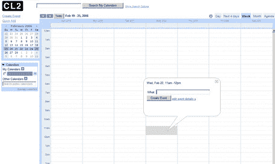

然而，今天之前就有消息泄露。有传言称，其中一名测试人员向雅虎提供了证书……尽管雅虎通知了谷歌(我猜是在彻底审查了产品之后)。

封闭测试正在进行，大约有 200 名参与者——参与者不允许邀请外人查看日历，并且根据严格的规定，不得与外人分享任何细节。根据我得到的反馈，CL2 离发布还有很长的路要走。

> **关于 CL2**
> 
> CL2 让你很容易甚至毫不费力地记录你生活中的所有事件，并与你的朋友和家人在他们生活中发生的事情进行比较。我们为您设计了一个日历，帮助您从电子邮件、朋友和其他公共日历中添加活动，这样您就不必花费所有时间来维护您的日程安排。CL2 甚至帮助你发现你可能感兴趣的新事件。我们认为它是一个很好的工具，可以管理您的日常日程，跟踪您家庭中每个人的活动，为俱乐部或团队组织活动，或者创建您可以向世界推广的公共活动。

CL2 与 Gmail 紧密结合。它包括现在标准的 web 2.0 功能——Ajax、用于集成 iCal 和其他桌面日历的订阅源、事件创建、搜索、共享、通知(包括短信)等等。

从事件创建功能也可以清楚地看出，Google 正在尝试像 eventful 和 zvents now 一样聚合事件。如果他们将事件创建功能与 web 爬行和事件数据解析结合起来(这正是 zvents 所做的)，他们将能够创建一个非常大的事件数据库。根据 CL2 可信测试员指南:

> **创建事件**
> 
> 您可以通过多种方式在日历上创建事件。
> 
> **点击‘创建活动’。**'这将带您进入创建活动页面，您可以在其中输入活动的相关信息。
> 
> **点击快速添加(或键入字母 Q)。**快速添加为您提供了一个文本框，您可以在其中用普通英语输入您的活动的所有信息，我们将为您填写表格。我们对此功能非常兴奋，所以请让我们知道它是如何为您工作的。
> 
> **拖动创建。**如果您想在日历上创建一个活动，只需点击鼠标，将其从所需的开始时间拖至结束时间。一旦你选择了你的时间范围，你可以为你的新事件选择一个标题。
> 
> **活动页面**
> 
> 每当您创建一个活动时，我们都会创建一个网页，当您单击任何活动的“更多详细信息”链接时，就会看到该网页。此网页仅对您可见，除非您邀请了其他人参加您的活动或将活动公开，在这种情况下，您可以使用该网页与参加活动的人或公众共享有关活动的信息。注意:您不必是 CL2 用户就能看到活动页面，因此您可以使用这些页面与参与活动的任何人共享信息，无论他们使用什么在线工具(如果有)。(曾经希望你最喜欢的当地乐队学会如何使用 HTML 并发布他们的日历吗？一旦我们收到您的反馈并向世界开放 CL2，您就可以帮助他们做到这一点。)

我不打算公布完整的指南，因为其中包含了我认为不适合公开披露的关于成为测试员的信息。

总的来说，CL2 是一款令人印象深刻的产品。与 Gmail 的紧密集成将使这款产品更加引人注目。其他[在线日历应用](https://web.archive.org/web/20230212004301/https://techcrunch.com/2006/01/30/spongecell-an-ajax-calendar/)将很难与之竞争。

## 其他屏幕截图:

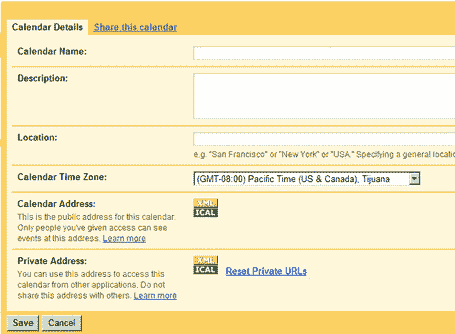

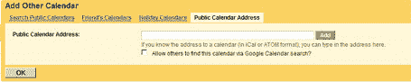

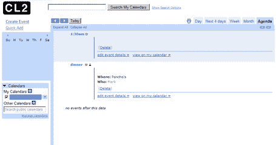

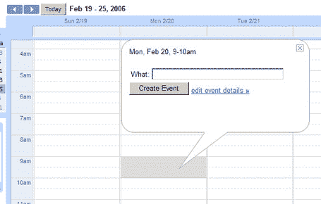

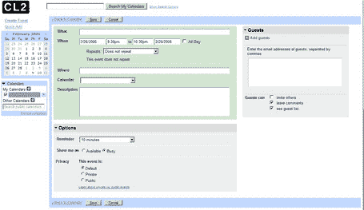

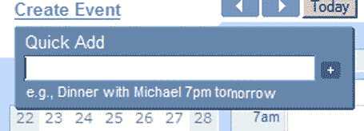

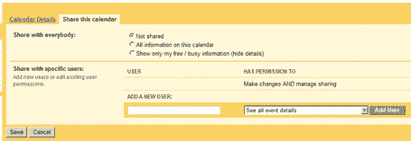

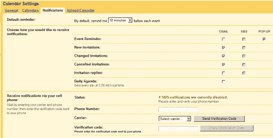

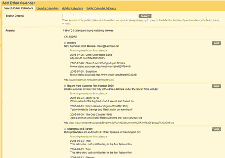

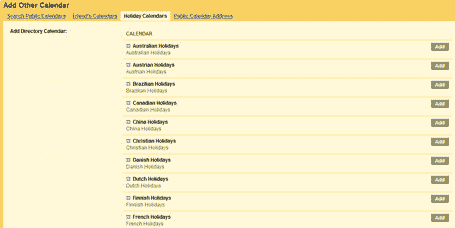