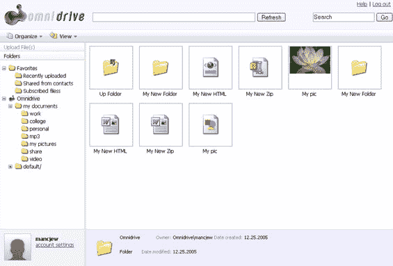
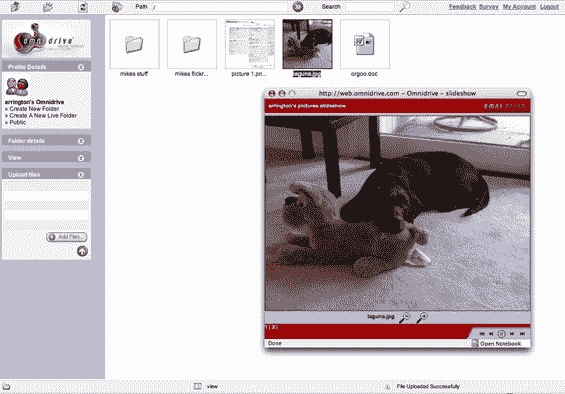

# Omnidrive-TechCrunch 独家截图

> 原文：<https://web.archive.org/web/http://www.techcrunch.com:80/2006/07/25/exclusive-screenshots-of-omnidrive/>

2005 年底，我们第一次报道了澳大利亚/硅谷的在线存储公司 [Omnidrive](https://web.archive.org/web/20220629010232/http://www.omnidrive.com/) 。从那时起，我们已经广泛地回顾了各种在线存储服务，包括传言中的谷歌和微软的产品，以及亚马逊为应用开发者提供的存储 API 解决方案。退一步说，这个空间继续升温。

快进六个月。Omnidrive 还没有发布，但是他们已经在继续构建他们的服务。上周，他们邀请了新一轮的产品测试人员，包括在线和客户端界面(仅限 Windows，Mac 仍在开发中)。我已经试用了这项服务，并发布了一些截图。

在线界面(这是我目前为止测试过的所有界面)运行得非常好，尽管仍然有一些 bug。我非常喜欢的一个功能是能够建立一种特殊的文件夹，称为“活动文件夹”，它与包含 RSS 提要的 URL 相关联。该提要中的任何附件(图像、声音文件等)都会自动上传到 omnidrive 文件夹中。为了测试这一点，我将 URL 上传到我的 flickr 页面，feed 中包含的图片(上传的最后 20 张图片)现在被自动复制到我的 Omnidrive 帐户。当我向 flickr 添加更多图片时，这些图片会自动与 Omnidrive 同步。这对播客和视频网站等同样适用。

Omnidrive 计划每天发出数百份邀请，直到他们向公众开放，他们说将在 9 月份的某个时候(预计会推迟)。

他们还发布了 web 服务 API 以及工具包和示例项目，供开发人员构建访问 Omnidrive 存储的应用程序。有了这个 API，开发者既可以构建现有 Omnidrive 用户可以使用的应用程序，也可以创建自己的用户，将 Omnidrive 纯粹用作后端。API 扩展到不仅仅是保存和检索文件，还具有用户管理、支付管理、媒体处理以及合作伙伴应用程序的用户使用其桌面工具来存储、检索和访问文件的能力。

API 的定价尚未公开宣布，但“将与 S3 和其他产品竞争”，基本 API 帐户是免费的。竞争对手 [Streamload](https://web.archive.org/web/20220629010232/http://www.streamload.com/) 和马克·库班支持的[Box.net](https://web.archive.org/web/20220629010232/http://box.net/)也有 API 产品，我们计划在不久的将来发布一篇帖子来比较所有四种存储 API 解决方案。

在他们的[主页](https://web.archive.org/web/20220629010232/http://www.omnidrive.com/)上注册 Omnidrive 测试版。最新版本的发布说明在他们的博客上[。](https://web.archive.org/web/20220629010232/http://www.omnidrive.com/blog/2006/07/24/051-release/)

披露:Omnidrive 首席执行官尼克·库布里洛维奇(Nick Cubrilovic)在 TechCrunch 上发表过客座博文，也是他的朋友。
 **Omnidrive 界面截图:**

