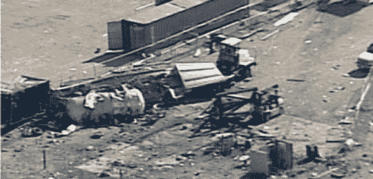

# 莫哈韦沙漠发生爆炸，两人死亡，四人受伤

> 原文：<https://web.archive.org/web/http://techcrunch.com/2007/07/27/explosion-in-mojave-desert-kills-two-injures-four/>

今天的坏消息是，在理查德·布兰森的太空飞船一号项目现场，莫哈韦沙漠发生爆炸，造成两人死亡，四人受伤。

那里的工程师正在测试一个宇宙飞船发动机，这时一氧化二氮流被点燃，引起了大爆炸。

Scaled Composites，LLC 是布兰森签约负责太空飞船一号项目的公司。参与爆炸的 6 人均为 Scaled 员工。

项目负责人伯特·鲁坦对事故感到非常不安。“我们在做一项我们认为安全的测试。我们不知道它为什么会爆炸。我们只是不知道，”他说。

爆炸停止了布兰森宇宙飞船的工作