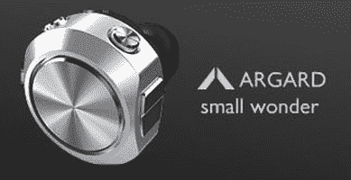

# Fabrix 2007 案例阵容| TechCrunch

> 原文：<https://web.archive.org/web/http://techcrunch.com:80/2007/03/15/fabrix-2007-case-lineup/>

在激动人心的 iPod 配件世界里，Fabrix 今天宣布了它的 2007 系列 iPod 外壳。这些箱子都是手工缝制的，设计精美，采用了一系列精选面料。设计范围从时髦的图案到简单、优雅的设计。每个箱子只有 20 美元，并配有一个环，所以你可以把它扔在你的腰带上或任何你喜欢的地方。如果你想在不倾家荡产的情况下让你的 iPod 风格化一点，绝对值得一试。

[官方网站](https://web.archive.org/web/20150915031242/http://www.fabrixcases.com/collection/ipod/sleeve/index.html)【via[iLounge](https://web.archive.org/web/20150915031242/http://ilounge.com/index.php/news/comments/fabrix-announces-2007-ipod-case-lineup/)