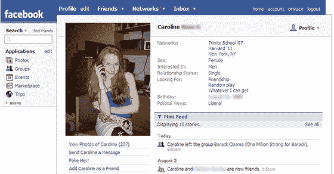

# 脸书让鲁迪·朱利安尼尴尬 

> 原文：<https://web.archive.org/web/http://www.techcrunch.com:80/2007/08/06/facebook-embarrassment-for-rudy-giuliani/>

# 脸书让鲁迪·朱利安尼尴尬

总统候选人的另一个社交网络尴尬是:鲁迪·朱利安尼 17 岁的女儿卡罗琳[支持](https://web.archive.org/web/20221209121353/http://slate.com/id/2171730)巴拉克·欧巴马而不是她的父亲竞选总统。直到今天早上，她还是脸书 T4 百万强支持奥巴马组织的成员，并把自己的政治观点列为“自由派”在 Slate 给她发了邮件之后，Caroline 将自己从这个群中删除了，但它仍然保留在她的新闻订阅中。

这当然不是社交网络第一次成为政治候选人的眼中钉。三月，参议员约翰·麦凯恩的 MySpace 个人资料被黑，暗示他支持同性婚姻。这一事件后来被《每日秀》报道。