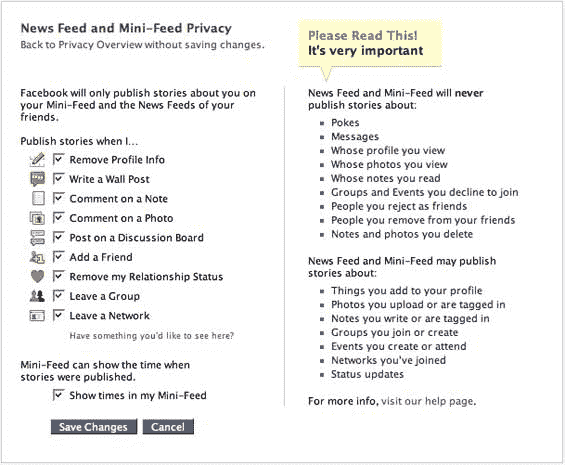

# 面对学生的反抗，脸书退缩了

> 原文：<https://web.archive.org/web/http://www.techcrunch.com:80/2006/09/08/facebook-folds-in-face-of-student-revolt/>

# 面对学生的反抗，脸书撤退了

 如果不熟悉最近在发生的有争议的变化，请阅读我们的帖子[这里](https://web.archive.org/web/20221220125120/http://www.beta.techcrunch.com/2006/09/05/new-facebook-redesign-more-than-just-aesthetics/)和[这里](https://web.archive.org/web/20221220125120/http://www.beta.techcrunch.com/2006/09/06/facebook-users-revolt-facebook-replies/)。

推出了两个新的相关产品，News Feed 和 Mini Feed，让脸书用户可以快速查看他们和他们的朋友在做什么——关系变化、添加图片和评论等。成千上万的脸书用户对新产品带来的隐私问题感到不满，很快组织了反脸书团体，要求撤回新产品。

创始人兼首席执行官马克·扎克伯格随后立即发表了一份初步声明，称脸书正在听取用户的意见，并考虑做出改变。今天早上，脸书[发布了对产品](https://web.archive.org/web/20221220125120/http://blog.facebook.com/blog.php?post=2208562130)的调整，这应该可以安抚最愤怒的 Facbook 用户。

> 因此，我们已经连续两天不停地编写代码，以便为您提供更好的隐私控制。这个新的隐私页面将允许你选择哪些类型的故事进入你的迷你订阅源和你朋友的新闻订阅源，它还列出了脸书永远不会让任何其他人知道的行动类型。

任何人如果对自己的一些或任何个人信息被包含在订阅源中感到不舒服，现在可以将其删除。脸书还自动删除了一些人们抱怨最多的数据——状态变化、添加的群组等。(参见下面显示设置的屏幕截图)。

这是一个很好的例子，说明一家公司倾听用户的声音，并以透明的方式迅速推动智能变革，以解决问题。脸书正在以一种良好的方式成长。

