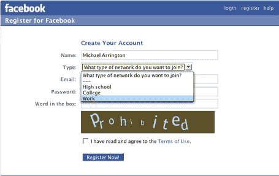

# 脸书超越大学、高中市场 

> 原文：<https://web.archive.org/web/http://www.techcrunch.com:80/2006/04/26/facebook-goes-beyond-college-high-school-markets/>

# 脸书超越了大学、高中市场

 [【脸书】](https://web.archive.org/web/20230123161019/http://www.crunchbase.com/company/facebook)据传每周产生约 100 万美元的收入，现在除了高中生和大学生之外，还允许来自企业网络的新用户加入他们的社交网络(基于电子邮件地址)。Niall Kennedy 能够使用微软员工的电子邮件地址注册。我无法使用我的 TechCrunch 电子邮件进行注册——目前仅支持某些公司。

对脸书来说，继续寻找新的市场是有意义的(这是之前预测过的)。85%的大学生已经在使用它了。如果他们想要吸引他们一直要求的 20 亿美元的价格，增长必须来自不同的用户群。

**更新:** [《脸书内幕》](https://web.archive.org/web/20230123161019/http://www.insidefacebook.com/?p=6)列出了脸书支持的十家公司:埃森哲、亚马逊、苹果、EA、Gap、英特尔、Intuit、微软、百事、普华永道和为美国而教。

