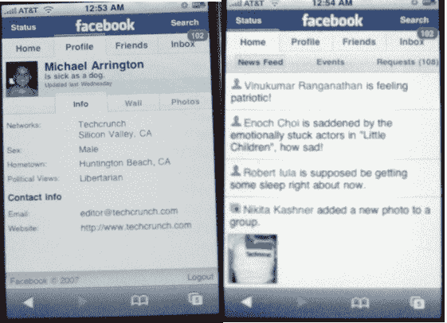

# 脸书+ iPhone =超酷——TechCrunch

> 原文：<https://web.archive.org/web/http://www.techcrunch.com:80/2007/08/15/facebook-iphone-ultrahype/>

# 脸书+ iPhone =超酷

今年最热门的两个科技产品的组合:[iphone.facebook.com](https://web.archive.org/web/20220818163559/http://www.crunchbase.com/company/facebook)脸书发布了可以说是迄今为止最好的 iPhone 定制网站。就像昨天晚些时候发布的 Netvibes iPhone 网站一样，在普通浏览器中看起来没什么。但是在 iPhone 上打开它，你会得到一个非常有用的网站。

该网站使用 javascript 来避免页面刷新，尽管在网站中移动仍有一些滞后(这是 iPhone 的问题)。主导航选项卡——主页、个人资料、朋友和收件箱——位于网站顶部。点击任何人，通过水平滚动界面查看他们的个人资料、墙壁或照片。

总的来说，除了偶尔的 javascript 错误，我会给它最高分。鉴于这还没有正式推出，我实际上期望比我能找到更多的错误。

我还没见过比这个更好的 iPhone 网站。如果你有，让我知道。许多创业公司将把这视为黄金标准。至少现在是这样。

今天早上的某个时候，在脸书的博客[上寻找一个公告。](https://web.archive.org/web/20220818163559/http://blog.facebook.com/)