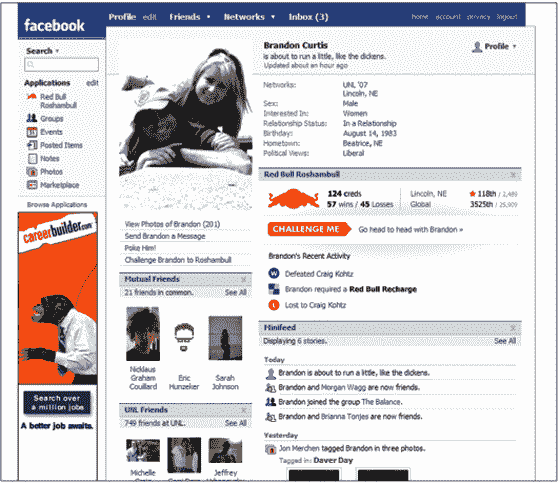

# 脸书推出 Facebook 平台；他们是反 MySpace | TechCrunch 的

> 原文：<https://web.archive.org/web/http://www.techcrunch.com:80/2007/05/24/facebook-launches-facebook->

 [脸书](https://web.archive.org/web/20230329064507/http://crunchbase.com/company/facebook)今天将在三藩市举办一场大型媒体/开发者活动，正式发布 Facebook 平台。大约有 750 人在这里。

一些第三方应用程序也将公布，包括微软，亚马逊，Slide，RockYou，Box.net，红牛，华盛顿邮报，Project Agape，Prosper，Snapvine，iLike，PicksPal，Digg，Plum 等。总共有 70 家公司正在开发应用程序。马克·扎克伯格将在下午 3 点上台发表官方声明，我将在这里进行博客直播。

脸书给予开发商前所未有的准入。举例来说，该 API 将允许第三方重新创建脸书照片，这是网络上最常用的照片应用程序。用户可以移除默认的脸书照片，安装第三方版本。

应用程序可以提供自己的广告和/或与用户进行交易。广告基本上可以在微软广告目前不显示的任何地方显示。

脸书上将有一个特殊的应用区域，用户可以在那里浏览和添加第三方应用程序。但也有一个至关重要的病毒成分——当一个朋友添加了一个应用程序，它会出现在他们个人资料的新闻流中。点击该项目会将您带到应用程序，您可以自己添加和/或与之交互。

用户也将在他们的网站上添加应用程序，其他人可以点击并将其添加到自己的个人资料中。这些应用看起来和其他脸书应用没什么区别。

回报是双向的。开发者不仅可以深入接触脸书的 2000 万用户，脸书也成为第三方应用的丰富平台。

脸书的策略几乎与 MySpace 截然相反。当 MySpace 为第三方插件烦恼，或者关闭或者收购它们的时候，脸书正在向所有外部开发者开放其核心功能。

**扎克伯格主题演讲笔记:**

脸书以每周 3%的速度增长，每天新增 100，000 名用户。

人口增长最快的是 25 岁及以上的年龄组。

50%的注册用户每天都会回到这个网站。

谈论脸书如何在去年开放注册，并推出新闻订阅。

脸书每月产生超过 400 亿的页面浏览量。也就是每个用户每天 50 页。

美国第六大流量网站

浏览量比易贝还多。称他们的下一个目标是谷歌。

应用程序:照片，组，事件。插入配置文件。利用人们所有的真实关系

他们的照片应用程序目前是互联网上排名第一的照片网站。

事件:类似的故事。通过 facebook 邀请参加活动的人数是 evite 的 3 倍。

称这些应用之所以如此成功，是因为“社交图”——人们通过社交图与朋友分享信息的网络。

特别是新闻订阅功能，可以通过社交网络将信息推送给更多的人，比历史上任何时候都要快。

深度整合，通过广告和交易赚钱的巨大自由。

微软副总裁 Dan Lewin 在台上谈论 Popfly 与脸书的整合。

台上的亚马逊高管

首席执行官麦克斯·拉夫琴在台上滑行。