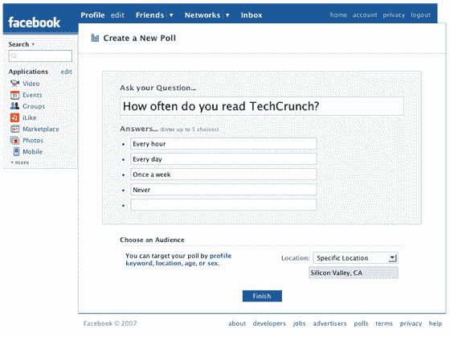

# 脸书民意调查今晚启动:营销研究天堂

> 原文：<https://web.archive.org/web/http://www.techcrunch.com:80/2007/06/01/facebook-polls-launches-tonight-marketing-research-paradise/>

# 脸书民意调查今晚启动:营销研究天堂

[脸书](https://web.archive.org/web/20230222182146/http://crunchbase.com/company/facebook)今晚刚刚发布了一款名为[的新产品，脸书民调](https://web.archive.org/web/20230222182146/http://www.facebook.com/polls.php)——在脸书的任何一个页面上，在底部导航区“广告”旁边寻找一个链接。

这是一个旨在创收的广告产品。用户可以创建一个投票问题和最多五个答案选项，然后根据性别、年龄、地点或个人资料关键字进行投票。

民意调查不是免费的——脸书会根据你想要的结果收取不同的费用。你告诉脸书你想要多少结果，你愿意为每个结果支付多少钱。您提供的越多，返回结果的速度就越快。目前的价格从每数据点 0.10 美元到 1.00 美元不等，外加 5 美元的初始插入费。脸书将根据你的出价来估计投票的完成时间。

民意调查出现在脸书用户的新闻订阅中。

我想品牌广告商和其他市场研究人员会喜欢这个产品。这将使他们能够以近乎实时的方式快速、有针对性地洞察脸书 2000 多万用户的口味和偏好。