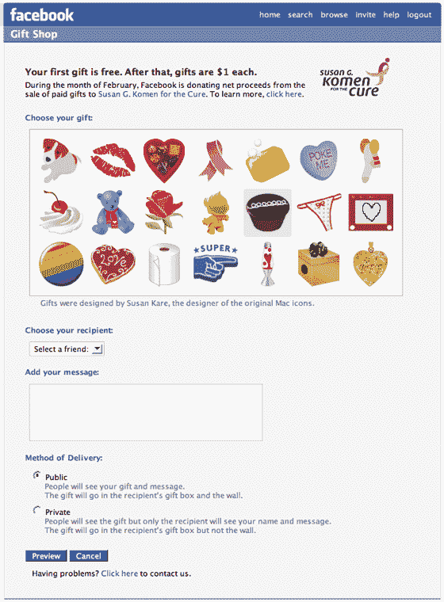

# 脸书测试虚拟礼物 

> 原文：<https://web.archive.org/web/http://www.techcrunch.com:80/2007/02/07/facebook-testing-virtual-gifts/>

# 脸书测试虚拟礼物

 [【脸书】](https://web.archive.org/web/20221104005247/http://crunchbase.com/company/facebook)正在[测试](https://web.archive.org/web/20221104005247/http://okdork.com/2007/02/07/breaking-facebook-adds-new-revenue-channel-social-gifts/)虚拟礼物——你可以送给其他脸书会员的小图标，这些图标将显示在他们页面的“墙”部分以及新的礼物区。这次测试的成员来自几所精选的学校。

礼物图标是由最初的 Mac 图标的设计师 Susan Kare 设计的。礼物可以公开发送，也可以私下发送(公开的礼物会给每个人看送礼人的名字，私下的礼物只显示图标)。每个虚拟礼物价值 1 美元，尽管现在它们是免费的。

在一次精彩的营销活动中，脸书将虚拟礼物的二月净收入捐给了慈善机构。之后，他们会留着钱。我预计到年底，这将成为他们的一个重要收入来源。

我之所以这么说，是因为“戳”在脸书已经是一项很大的活动了，在这里你可以接触到其他用户。当你付钱做同样的事情，意味着更多，人们会被吸引去做这件事。如果脸书推出高档礼品，人们也会购买。我还希望他们能在限量供应的情况下出售真正高端的“限量版”图标。

