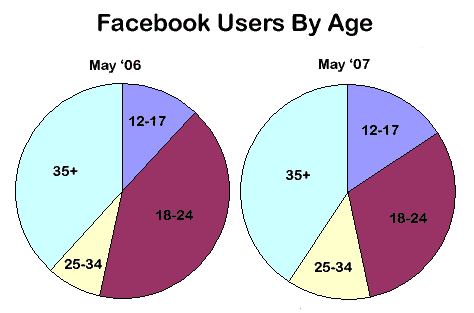

# 脸书用户比去年增长了 89%;人口变化 TechCrunch

> 原文：<https://web.archive.org/web/http://www.techcrunch.com:80/2007/07/06/facebook-users-up-89-over-last-year-demographic-shift/>

# 脸书用户比去年增长了 89%;人口变化

康姆斯克[报道了](https://web.archive.org/web/20221207202942/http://www.comscore.com/press/release.asp?press=1519)关于[脸书](https://web.archive.org/web/20221207202942/http://www.crunchbase.com/company/facebook)的一些有趣的数据，揭示了该网站在去年九月开放后的增长及其人口统计数据。在过去的一年里(2006 年 5 月至 2007 年 5 月)，脸书网站的独立访客增加了 89%，达到 26，649，000 个，页面浏览量增加了 143%，达到 158 亿。该网站的粘性增加了，然后在每个用户平均 190 分钟左右逐渐减少。

该网站还见证了人口统计学向青少年和研究生的转变，因为它走出了大学人群。也许这就是罗伯特·斯科博[收到如此多好友请求的原因](https://web.archive.org/web/20221207202942/http://scobleizer.com/2007/06/25/the-invisible-audience-shows-up-on-facebook/)。

