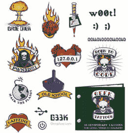

# 大男子主义书呆子的假纹身

> 原文：<https://web.archive.org/web/http://techcrunch.com/2007/07/19/fake-tattoos-for-the-macho-nerd/>

书呆子很有男子气概。没错。永远不会发生，但是你可以一直假装很强硬！为什么不从阿奇·麦克菲那里买一套这种怪胎纹身呢？你会得到 16 个最愚蠢、最讨厌的纹身。所有的经典都在，包括“Pwn3d！！!"，“w00t！”，以及“127.0.0.1”。如果这些都不能让你成为一个玩魔兽世界*的 400 磅重的盲女，我不知道还有什么能做到。*

 *对于经常玩《光晕 2》或喝《雷震》的人来说，这是一份非常棒的礼物！可乐一整天。我很确定我会给我喜欢 FPS 动作的表弟买一套。

[极客纹身](https://web.archive.org/web/20151206235030/http://www.popgadget.net/2007/07/tattoos_for_gee.php)【pop gadget】*