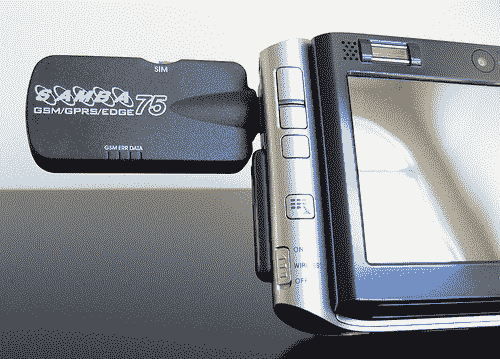

# 适用于移动设备的 Falcom Samba USB EDGE 适配器

> 原文：<https://web.archive.org/web/http://techcrunch.com/2006/08/16/falcom-samba-usb-edge-adapter-for-mobile-devices/>

您不仅可以将它用作笔记本电脑和 UMPCs 的无线 EDGE 调制解调器，甚至还可以在 GSM 网络上拨打电话或发送/接收传真。你所要做的就是把你的 SIM 卡插到设备的侧面，把它插到 USB 接口上，然后你就可以在任何地方享受 1998 年的网速了。

我们能看到的唯一问题是，你必须在你的服务提供商那里有一个单独的纯数据账户，或者当你的 SIM 卡在里面时，依赖于使用你的笔记本电脑作为你唯一的通话设备。这两个都不是理想的解决方案。

[产品页面](https://web.archive.org/web/20141106204402/http://www.falcom.de/index.php?id=199)【Falcom via[今日移动](https://web.archive.org/web/20141106204402/http://mobilitytoday.com/news/Falcom_USB_EDGE.html)