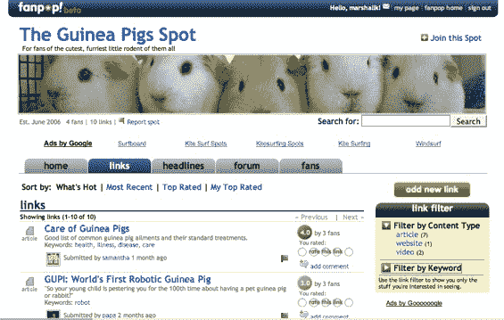

# Fanpop:分享热门信息的简单有趣的方式 

> 原文：<https://web.archive.org/web/http://www.techcrunch.com:80/2006/08/10/fanpop-makes-web-20-topical-and-usable/>

# Fanpop:一种简单有趣的分享热门信息的方式

  [Fanpop](https://web.archive.org/web/20230203022922/http://fanpop.com/) 是一个最近推出的网站，汇集了用户提交的链接、联合头条、论坛和社交网络。它自称是一个让粉丝分享他们喜欢的任何话题内容的地方。这一款在可用性上得分很高，很有可能脱离技术领域。

由旧金山的一个团队开发的 Fanpop 是一个实现得非常好的 Ruby on Rails 站点。创始人戴夫·卢和大卫·帕潘德里欧在雅虎工作时相识。1999 年，他们一起融资，并请来了为工程师做饭的创始人 Michael Chu 和 Cliff Szu 来充实这个团队。这种商业模式非常符合逻辑，主题页面获得上下文广告和附属链接，以便在与主题相关的在线购物网站购买商品。它可能不会赚大钱，但如果有足够的流量，它很可能是可持续的。

开始主题“点”的用户可以放入他们自己的横幅图形，选择一个 RSS 源进行聚合，并将第一个主题链接添加到点的列表中。链接可以评级，评论，标记和标签。用户评级和贡献也被跟踪。点击一个标签会在你的位置显示相同标签的内容，而不是整个网站。链接可以过滤文章，整个网站，视频等。当您将另一个用户添加为好友时，您将看到他们在您自己的页面上标记、提交和评级的所有内容。它有一种很棒、干净的感觉，使用起来很有趣。

从 MySpace 到雪茄，再到素食主义，许多话题已经开始流行起来，足以让你看到这个网站的运行。有人甚至在 TechCrunch 上开了一个广告位——尽管豚鼠广告位是我目前最喜欢的。

Fanpop 团队在网站导航方面做得非常好。用户资料、评分和不同种类的链接在这里不是事后的想法——它们确实是网站的基础。熟悉 Squidoo 的人可能会认为这是旧闻，但 Fanpop 有一个真正干净的外观和更多的定制，社交和协作功能。

像辛迪加、聚合内容和用户排名这样的技术很吸引人，但很难走出科技新闻和购物的超级极客世界。人们想使用这些功能来交流非常具体的话题吗？如果推出后一切都像网站设计的那样顺利，Fanpop 可能是一个有趣的测试案例。

