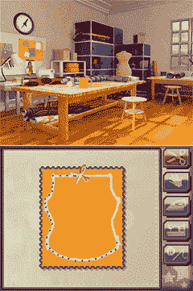

# 时装设计师:时尚偶像 DS 发布——TechCrunch

> 原文：<https://web.archive.org/web/http://techcrunch.com:80/2007/06/25/fashion-designer-style-icon-ds-announced/>

# 时装设计师:风格图标 DS 宣布

刚刚签了切尔西新公寓的租约，需要一种庆祝方式？当你 11 月搬进来的时候，你可以为任天堂 DS 拿一本*时尚设计师:风格图标*来帮你装饰。既然你如此热爱室内装饰，你可以用你的任天堂 DS 来布置家具，尝试不同颜色的地毯，甚至看看你想把窗帘拉得多低。简直难以置信！

但是*风格图标*更进一步，让你与公司达成交易和合同，设计可以模仿的新服装，等等。这款游戏将于 11 月上市，并将在休斯顿以南及更远的地方的精品零售店出售。

[服装设计师:风格偶像 DS](https://web.archive.org/web/20211107082903/http://kotaku.com/gaming/pret_a_porter/fashion-designer-style-icon-ds-271884.php)【Kotaku】