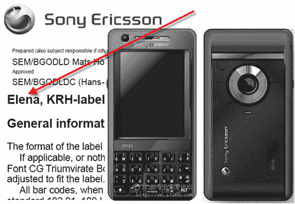

# FCC 批准 SE M610I，又名 Elena | TechCrunch

> 原文：<https://web.archive.org/web/http://techcrunch.com/2007/06/19/fcc-approves-se-m610i-aka-elena/>

索尼爱立信即将推出的 M610I(又名 Elena)似乎是一款热门硬件，其规格清单已在 FCC 文件中披露。M610I 将通过三频 GSM 900/1800/1900、UMTS、WiFi 以及蓝牙等一些可能会引起您兴趣的标准功能进行连接。320 万像素的摄像头一直是一个热门卖点，2.6 英寸的 QVGA 屏幕也不算太差。对于一部拥有如此高分辨率摄像头的手机来说，板载存储是至关重要的，160MB 的存储空间并不算大，但它应该可以完成任务。我假设会有一个外部扩展槽，否则 se 团队已经陷入困境，在这种情况下，他们都应该被解雇。希望在一个月内，当用户手册公之于众时，一些更吸引人的规格将会被揭示。

[FCC 备案](https://web.archive.org/web/20160315214037/https://gullfoss2.fcc.gov/oetcf/eas/reports/ViewExhibitReport.cfm?mode=Exhibits&RequestTimeout=500&calledFromFrame=N&application_id=478596&fcc_id='PY7FD022015')【经[无线查看](https://web.archive.org/web/20160315214037/http://www.unwiredview.com/2007/06/19/sony-ericsson-m610i-elena-approved-by-fcc/)