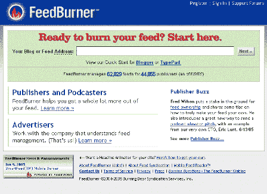
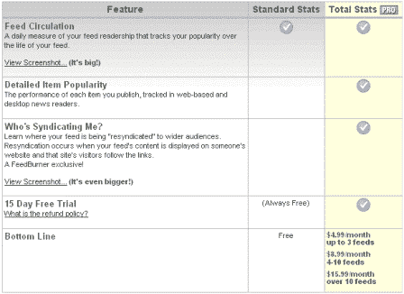
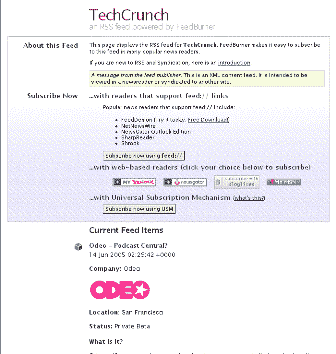

# FeedBurner 简介——TechCrunch

> 原文：<https://web.archive.org/web/http://www.techcrunch.com:80/2005/06/14/feedburner-profile/>

**公司:** [喷灯](https://web.archive.org/web/20220106162507/http://www.feedburner.com/)

**地点:**芝加哥

**什么事？**

FeedBurner 是一种服务，它获取任何类型的普通日常 RSS 或 Atom 提要，并将其转换(刻录)成一个 *FeedBurner* 提要，然后您可以将其分发给读者，供他们在任何 RSS 阅读器中使用。该公司目前为 40，000 多家内容发布商托管超过 60，000 个 RSS 和 Atom 提要。该公司的托管服务目前每天处理超过 500 万次的 RSS 内容浏览，包括播客和视频博客。

博客或网站所有者想要使用它的一个原因是因为它简化了 RSS 提要。例如，Techcrunch 的提要 URL 是“http://feeds . feedburner . com/Techcrunch”，这是一种比标准 RSS 提要更简单的格式。此外，大多数博客软件都提供了各种各样的 RSS 提要——Atom、RSS 1.0、2.0 等。有时，这些提要对某些读者来说不能正常工作。如果一个网站可以让它的大多数读者使用单一 Feedburner feed，他们就可以利用大量的统计数据和工具来查看读者来自哪里，他们点击了什么。

FeedBurner 提供两种服务——免费版和专业版，根据管理的 feeds 数量，每月收费 5-16 美元。免费版的统计数据很棒，而专业版也显示了更多的细节和“谁在联合我”的功能。专业版有 15 天的免费试用期。

然而，使用 FeedBurner 的主要原因是，它可以自动将 Google Adsense 添加到你的提要中，如果你有足够多的受众，这可以让你轻松创收。然而，有许多有影响力的博主不喜欢这项服务(以及 FeedBurner 的其他方面)——更多信息请参见下面的相关链接。

FeedBurner 的一个缺点是很难关闭它，也很难将你的 feeds 从网络上移走(同时保留你的观众)。这样做的方法既复杂又笨拙(或者需要你从自己的服务器上运行你的网站),所以许多顶级博客都远离他们的服务。

然而，在 2005 年 6 月 10 日，FeedBurner [宣布了](https://web.archive.org/web/20220106162507/http://www.burningdoor.com/feedburner/archives/001251.html)(这是 FeedBurner 的博客)一个新的功能，允许从 FeedBurner 轻松过渡，同时保留你的读者。干得好。

因此 FeedBurner 提供了易用性、强大的统计数据、收入和相对无痛的出路。TechCrunch **的好评，这也是我们使用它们的原因**。

**主要特点:**

–非常容易使用
–feed 的漂亮 URL 字符串
–从 RSS 广告中获得收入
–RSS 页面不仅仅是 xml 代码，它还有漂亮的外观/感觉
–你的 feed 的统计数据非常棒
–如果你想离开，可以很容易地从 FeedBurner 中转移出来

**屏幕截图:**

**管理:**

迪克·科斯特罗，首席执行官
埃里克·伦特，首席技术官
史蒂夫·奥莱乔斯基，首席运营官
马特·肖贝，首席设计官
[链接](https://web.archive.org/web/20220106162507/http://www.feedburner.com/fb/a/team)

**相关链接:**

[FeedBurner 博客](https://web.archive.org/web/20220106162507/http://www.burningdoor.com/feedburner/)
[弗雷德·威尔森在 Feedburner 上](https://web.archive.org/web/20220106162507/http://avc.blogs.com/a_vc/2005/06/its_my_feed_stu.html)
[戴夫·维纳在 FeedBurne 上发帖](https://web.archive.org/web/20220106162507/http://archive.scripting.com/search/default?q=feedburner)r
[Feedburner 上的工作台](https://web.archive.org/web/20220106162507/http://www.cadenhead.org/workbench/entry/2005/03/26#2524)
[尼克·布拉德伯里](https://web.archive.org/web/20220106162507/http://nick.typepad.com/blog/2005/06/experimenting_w.html)
[亚历克斯·博斯沃思在 Feedburner 上](https://web.archive.org/web/20220106162507/http://sourcelabs.com/ajb/archives/2005/06/feedburner_anno.html)
[larixconsulting.com](https://web.archive.org/web/20220106162507/http://blog.larixconsulting.com/blog/_archives/2005/6/5/911126.html)
[blog.bulknews.net](https://web.archive.org/web/20220106162507/http://blog.bulknews.net/mt/archives/001733.html)
[Feedburner 博客支持 iTunes 和 Odeo 扩展 RSS 支持](https://web.archive.org/web/20220106162507/http://www.burningdoor.com/feedburner/archives/001287.html)