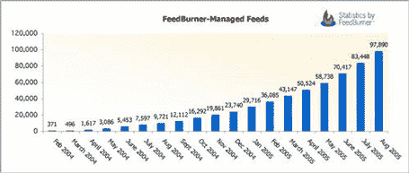
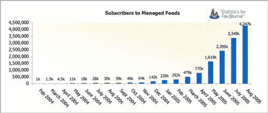

# Feedburner 发布重要数据 

> 原文：<https://web.archive.org/web/http://www.techcrunch.com:80/2005/09/21/feedburner-releases-important-stats/>

# Feedburner 发布重要数据

 [Feedburner](https://web.archive.org/web/20221129064350/http://www.feedburner.com/) 昨天发布了关于他们服务的重要统计数据。如果你对 Feedburner 不熟悉，看看我们最初的[简介](https://web.archive.org/web/20221129064350/http://www.beta.techcrunch.com/?p=15)。

这些图表显示了由 feedburner 管理的所有提要以及这些提要的所有订阅者。两者都显示出曲棍球棒般的增长，看起来与 Technorati 发布的数据相似(见过去 TechCrunch 每周总结[中的第 2 项](https://web.archive.org/web/20221129064350/http://www.beta.techcrunch.com/category/this-week/page/2/))。

我相信这些统计数据与博客总体上非常相关。我们正处于一个稳步增长的潮流中，而且增长速度越来越快。所有的船都在上升。

Feedburner 现在管理着大约 10 万个订阅源，大约有 430 万人订阅这些订阅源。增长率显而易见:

[Paul Kedrosky](https://web.archive.org/web/20221129064350/http://paul.kedrosky.com/archives/001779.html) 注意到 feed 订阅用户的数量大约每 60 天翻一番。

我想知道的是每月支付 5 美元的 Pro 产品的百分比。如果它在 5%左右(这是我的猜测)，那么 FeedBurner 的收入(不包括广告)年化大约为 30 万美元左右。

唯一要问的是，你有你的 FeedBurner 贴纸吗？我知道。

我们以前在 2005 年 9 月 7 日、[2005 年 7 月 15 日](https://web.archive.org/web/20221129064350/http://www.beta.techcrunch.com/?p=86)、[2005 年 7 月 4 日](https://web.archive.org/web/20221129064350/http://www.beta.techcrunch.com/?p=67)和[2005 年 6 月 14 日](https://web.archive.org/web/20221129064350/http://www.beta.techcrunch.com/?p=15)写过关于 Feedburner 的文章。