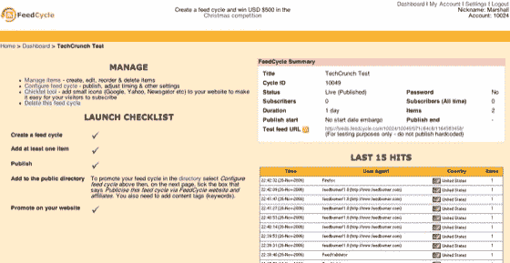

# FeedCycle:更聪明的连载故事 TechCrunch

> 原文：<https://web.archive.org/web/http://www.techcrunch.com/2006/11/26/feedcycle-smarter-serialized-stories/>

# FeedCycle:更聪明的连载故事

  [FeedCycle](https://web.archive.org/web/20230123170306/http://www.feedcycle.com/) 是一个新工具，它用一个非常简单的界面为 RSS 订阅的发布者提供了一个有趣的控制级别。如果你正在讲述一个多部分的故事，或者在一段时间内传达一个分段的信息，你应该看看 FeedCycle。出版商可以使用 FeedCycle 创建出版计划和间隔；然后，所有订阅者开始接收提要中的第一个项目，而不管他们何时订阅，以后的项目将按发布者确定的时间间隔发送。文本、音频和视频播客都可以通过 FeedCycle 进行安排和交付。

FeedCycle 是英国旅游技术咨询公司[旅游 UCD](https://web.archive.org/web/20230123170306/http://www.tourcms.com/company/) 的产品。该公司的许多示例提要都是连载的旅行故事。一次访问所有信息有明显的价值，但老式的故事连载对观众有明显的影响，这家公司作为服务提供商很聪明地利用了这一点。

通过 FeedCycle 连载的故事可以通过 RSS 提供，而不需要一次全部交付——例如，我可以订阅并观看一系列视频播客，直到我看到前几集，我才能看到最后一集。如果我经营一家企业，我可以预先录制一系列培训课程，每个新员工都可以订阅该系列课程，然后每隔一段时间就会收到一个新的培训课程。

FeedCycle feeds 也可以通过 FeedBurner 运行，进行比服务本身更详细的分析。该服务在免费版本中有一个庞大的功能列表，并提供高级订阅功能，如使用自己的域名、通过 word 保护和加密订阅。该服务的所有版本都支持按批次或标签进行标记和 OPML 导出。

剧集可以通过拖放来重新排序，附件可以通过指向一个 URL 来很好地处理，结果提要也可以验证。您可以选择一个发布日期窗口，项目可以以一小时到一个月的间隔定期发布。

我喜欢 RSS 在很大程度上是因为所有的服务都建立在它的基础上。FeedCycle 是另一个聪明、简单地利用提要的例子。这不是大多数博客作者最终会使用的东西，但随着消费者和企业 feed 阅读器、RSS 在其他应用程序和工具(如 Ajax startpages)中的集成激增，我们将在未来看到 RSS 的更多用途。这是一个不受时间限制的在线交流者可以充分利用的工具。如果你担心你的订户还没有广泛使用 RSS，那么通过 RSS-to-email 服务提供预定递送也是一样容易的。
