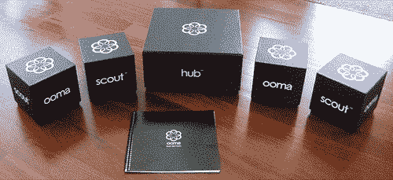

# Oomas For Readers，请告诉我们你为什么想要它 

> 原文：<https://web.archive.org/web/http://www.techcrunch.com:80/2007/07/19/fifty-oomas-for-readers/>

# Oomas 给读者，只要告诉我们你为什么想要它

你[读了故事](https://web.archive.org/web/20221002013948/http://www.beta.techcrunch.com/tag/ooma)，你[听了播客](https://web.archive.org/web/20221002013948/http://www.talkcrunch.com/2007/07/18/interview-with-ooma-execs-andrew-frame-and-ashton-kutcher/)。现在，你可以在 9 月向公众销售之前亲自尝试一下。

我们有 50 个要送出。这与大多数账户赠品不同——这些套餐中的每一个都将在 9 月份以 399 美元的零售价出售，并为您的普通手机提供终身免费的 VOIP 电话服务(您或公司的生命，以先结束者为准)。你可以免费得到，而且现在就可以得到。

关于这些还有一件很酷的事情——每一个都包括三个免费的“白兔”代币，你可以分发给其他人，这样他们也可以尝试 Ooma。他们的数量有限，但他们会继续给每个人三个，直到他们开始用完。

这是你必须做的。请在下面写一个简短的评论，告诉我们你为什么想要它。或者告诉我们你最喜欢的阿什顿·库彻[电影或电视节目](https://web.archive.org/web/20221002013948/http://www.imdb.com/name/nm0005110/)(因为他是公司的创意总监)。或者两者都有。你不必诚实或友好，但你必须有创造力和娱乐性。你所要做的就是成为 50 个最有趣的评论之一，然后你就被录取了。你必须在周五加利福尼亚时间结束前写完。请确保在评论中使用您的真实电子邮件地址，否则我们不知道如何与您联系。

Ooma 目前只在美国发货，所以你一定住在这里。还有一条规则——我们将在今晚晚些时候将 Ooma 添加到[邀请共享](https://web.archive.org/web/20221002013948/http://www.inviteshare.com/)中，并允许人们注册获得一个。如果您被选中，您必须同意将至少一个系统提供给邀请共享列表顶部的人。这样，我们就有可能向 TechCrunch 的读者提供更多这样的信息。

**更新:**好的 [Ooma 现在在 InviteShare](https://web.archive.org/web/20221002013948/http://www.inviteshare.com/site.php?id=46) 上，所以请随意将你的名字添加到想要邀请的人的名单中。列表顺序是根据您输入姓名的时间以及您发出的其他服务邀请的数量来确定的，因此通过参与来提升列表。如果你是从这篇文章中直接收到邀请的 50 个人之一，请把你的名字从名单中删除——记住至少把你收到的一个邀请给名单上的人。