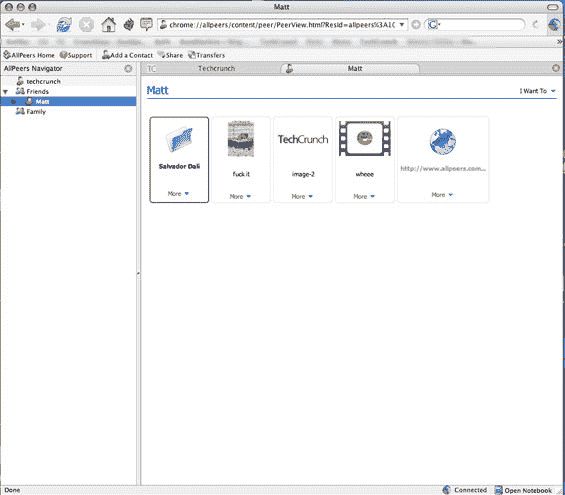

# 最后(几乎):所有同行

> 原文：<https://web.archive.org/web/http://www.techcrunch.com:80/2006/08/15/finally-almost-allpeers/>

  基于英国/布拉格的 [AllPeers](https://web.archive.org/web/20220819042908/http://www.allpeers.com/) 是一个 Firefox 扩展，允许使用浏览器进行群组 P2P 文件共享。侧边栏中的持久好友列表被创建。通过将文件、文件夹或 URL 拖到这些好友的名字中，可以与他们共享文件。与多人共享文件同样简单。核心技术基于 bittorent。

我们跟踪了所有同行的最初传言、首次公开的截图以及红树林资本和指数风险投资公司三月份的风险投资。

他们最近保持沉默，说他们一直在对他们的界面进行小的改变，对他们的基础设施进行大的改变，以处理发布时的扩展问题。我一直在和联合创始人马修·格特纳一起测试这个产品——这将会是一个非常受欢迎的应用。在我的测试中，非常大的(视频)文件传输没有困难，包括在传输过程中反复关闭浏览器之后。像其他 bittorent 客户端一样，重新启动后传输又恢复了。

该公司不会说他们何时推出，但他们已经在测试用户中出血了几个星期，日期显然不是那么遥远。他们还说，他们将允许我立即给予 ~~50~~ 300 个即时访问帐户——这些是评论中的先到先得。在评论里给我你想用的邮箱地址就行了。

这一领域的潜在竞争对手是我们最近报道过的 Zapr。Zapr 通过一个独立的客户端处理文件共享。AllPeers 表示，他们也将在今年晚些时候推出非浏览器客户端。

