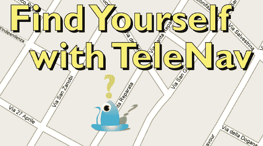

# 通过 TeleNav Update  寻找自我

> 原文：<https://web.archive.org/web/http://techcrunch.com:80/2007/02/16/find-yourself-with-telenav-update-3/>

终点是马嘶！在电视导航大赛结束前，你还有 6 个小时的时间。

要参赛，请发送电子邮件至 contest at crunchgear dot com，解释你关于定向障碍的最佳故事(使用主题:“迷路”)。比赛从今天开始一直持续到美国东部时间周五中午。我们会发布最好的故事，然后大家投票选出获胜者。

获胜者将获得一个 TeleNav GPS 接收器和三个月的 TeleNav 服务。在 [TeleNav](https://web.archive.org/web/20160915234816/http://www.telenav.com/) 服务范围内的任何人都有资格。

祝你好运。