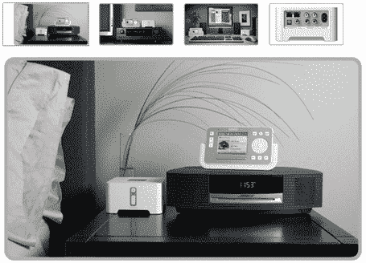

# 对 Sonos 的第一印象——TechCrunch

> 原文：<https://web.archive.org/web/http://www.techcrunch.com:80/2006/04/23/first-impressions-of-sonos/>

  我花了一个周末在家里安装并使用了一套 [Sonos](https://web.archive.org/web/20190803124348/http://www.sonos.com/) 音乐系统。Sonos  销售连接到你家庭网络的硬件，在你的房子周围播放数字音乐和网络电台(还有 Rhapsody)。每个硬件都是一个独立的区域，所以不同的音乐可以在你家的不同区域播放，所有这些都由一个无线手持设备控制。

有很多硬件——两个[zp80](https://web.archive.org/web/20190803124348/http://www.sonos.com/products/zoneplayers/zp80/features.htm)，一个 [ZP100](https://web.archive.org/web/20190803124348/http://www.sonos.com/products/zoneplayers/zp100/features.htm) (加上扬声器)和一个[控制器](https://web.archive.org/web/20190803124348/http://www.sonos.com/products/controller/features.htm)，但是我的房子现在完全不适合音乐，我是一个人能有多高兴就有多高兴。

这种东西很贵，但是安装和使用起来非常简单。你把任何一个主要单元插入路由器，在你的 PC 或 Mac 上安装软件，然后在你想要播放音乐的房子周围插入其他单元。将它指向您网络上的音乐收藏，或者使用 Rhapsody 或预先选择的互联网电台。ZP80 单元较小，需要插入某种放大设备——立体声系统、电脑等。ZP100 单元内置一个放大器，可以直接插入扬声器。

这些都是可以互换的，你可以在一个房间使用 ZP100，在另一个房间使用 ZP80(我就是这么做的)。它们也是模块化的，因此您可以随时添加新的组件。

该控制器的工作方式很像 iPod，有两个我经常使用的功能。第一个是动态排队的能力(当你在听另一首歌的时候把歌曲加入队列)。第二个是内置在软件中的特定类型的电台——我整个周末都在听洛杉矶的 KROQ。

如果你是一个音乐迷，这是给你的。总设置时间:25 分钟。

在不久的将来，我们将在 TechCrunch 上测试更多的小工具。

