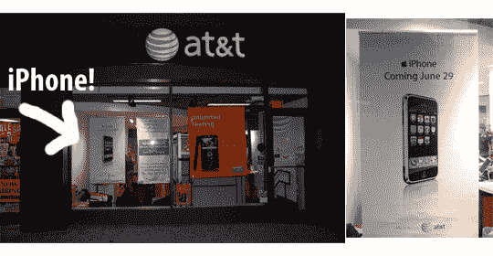

# 首次发现店内 iPhone 广告

> 原文：<https://web.archive.org/web/http://techcrunch.com/2007/06/08/first-in-store-iphone-ads-spotted/>

# 首次发现店内 iPhone 广告

保持住。的。电话。 [iPhone](https://web.archive.org/web/20130628204706/http://crunchgear.com/2007/06/07/the-futurist-we-predict-the-iphone-will-bomb/) ，也就是。AT & T 店内 iPhone 广告的第一张图片已经出现在网上，全球数百万人正在浏览。这主要是视觉糖果，我们今天在这里展示它，以激起你对苹果改变文明的手机的兴趣。万岁。

[T 店的 iPhone 横幅](https://web.archive.org/web/20130628204706/http://www.macrumors.com/2007/06/07/iphone-banners-at-atandt-stores/)【Mac 传闻】