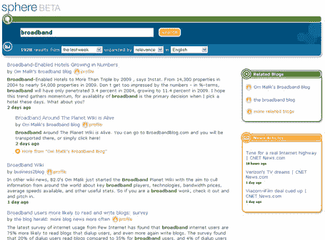

# Sphere TechCrunch 的第一个屏幕截图

> 原文：<https://web.archive.org/web/http://www.techcrunch.com:80/2005/10/14/first-screen-shot-of-sphere/>

**Company:** [Sphere](https://web.archive.org/web/20221207202623/http://www.sphere.com/) **Launched:**

本周末发布私人测试版

**Status:**

由道格·麦肯齐、凯文·康普顿、菲尔·布莱克、威尔·赫斯特、大卫·马奥尼、文斯·万内利和迈克·温顿资助

**Previous Post:** [October 8, 2005](https://web.archive.org/web/20221207202623/http://www.beta.techcrunch.com/2005/10/08/will-sphere-be-blog-search-20/) **Location:**

帕洛阿尔托

我今天在我们的办公室会见了[托尼·康拉德](https://web.archive.org/web/20221207202623/http://yodelt.wordpress.net/about)，他是[球体](https://web.archive.org/web/20221207202623/http://www.sphere.com/)的创始人之一(好吧，这是一所房子，但它也是一间办公室——问问国税局就知道了)。Sphere 是一个新的博客搜索引擎，坦率地说，它摧毁了一切，我是说一切，我已经在相关性方面(顺便说一下，设计…涉及到了自适应路径)看到了水面。

这次会面的时机非常完美——就在雅虎新的[博客搜索引擎](https://web.archive.org/web/20221207202623/http://www.beta.techcrunch.com/2005/10/10/yahoo-blog-search/)和罗伯特·斯考伯斯已经发表经典文章“[基于时间和博客搜索的竞赛](https://web.archive.org/web/20221207202623/http://scobleizer.wordpress.com/2005/10/13/the-race-to-time-based-and-blog-search/)之后。

托尼与联合创始人史蒂夫·尼克和马丁·雷米以及顾问马特·莫楞威格、玛丽·霍德和托尼·施尼德在很短的时间内用“不到 20 万美元”创建了 Sphere。

我看到了现场直播，并被允许尽我所能地敲打它。我去了，并且留下了深刻的印象。

博客搜索中的相关性是非常困难的。谷歌式的 PageRank 分析，查看一条内容的链接，根本不起作用，因为新内容没有太多的链接。到目前为止，还没有人想出一种方法来根据相关性对博客文章进行适当的排序，通常默认的显示结果的方式是“反向计时”，即将最新的内容放在最上面。

Sphere 似乎已经解决了这个问题，或者至少在正确的方向上迈出了一大步。他们的方法包括三个关键算法——分析一个博客的链接，分析一篇文章的元数据(链接、文章频率、文章长度等)。)，以及 Tony 称之为他们的“秘密酱”的东西，这是一种内容语义分析，用于过滤垃圾邮件，并理解一篇博客文章在谈论什么。

结果集显示每个博客在第一页只有两篇文章，所以没有一个博客可以主宰一个类别。结果集具有自动生成的博客配置文件，包括博客的最近链接、每周平均帖子数、每篇帖子的平均字数以及可由博客作者编辑的完整页面配置文件的链接。

在主结果集的右边是与查询相关的博客(相对于帖子)链接，以及他们称之为“日常领域”的东西，这是指向相关非博客新闻故事的链接。我想他们可能会在侧边区域添加额外的内容。

结果页面以一种智能的方式集成了 ajax 和 flash 特性(它不仅仅是为了展示)。

虽然 Sphere 从 2003 年 1 月开始索引博客，但是他们的索引只显示前四个月的结果。随着业务规模的扩大，他们会延长这个窗口。

Sphere 有数万个测试请求，本周末将向 100 名幸运者开放。[在这里报名测试](https://web.archive.org/web/20221207202623/http://www.sphere.com/)。