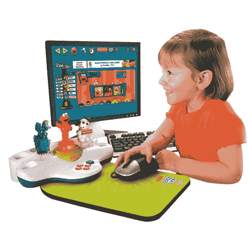

# fisher Price Easy Internet Launch Pad:让你的孩子从小就沉迷于互联网

> 原文：<https://web.archive.org/web/http://techcrunch.com:80/2007/08/03/fisher-price-easy-internet-launch-pad-get-your-kid-addicted-to-the-internet-at-an-early-age/>

我第一次使用互联网是在 1996 年的圣诞节，离我 11 岁生日还有两个月。如今，孩子们在刚从子宫里出来后就开始查看他们的脸书 T4 账户。感觉到一个“新兴的”市场，费希尔推出了简易互联网发射台。这款设备本质上是一款儿童玩具，它让即将成为网虫的人可以浏览像 Elmo 这样熟悉角色的网页。孩子们把这个角色放到 pad 上，pad 就会启动他们的网站。我猜 Elmo 有个 [MySpace](https://web.archive.org/web/20160417201125/http://crunchgear.com/category/myspace/) 什么的。该网站是真实的，而不是一些伪围墙花园的东西；对其他网站的访问受到软件的限制。

“轻松链接”需要一台 Windows PC 和一个活跃的互联网连接(duh ),以及对您的孩子足够的信任，以便将这小小的一束快乐带进互联网这个狂野的西部。它也很便宜，只要 30 美元。

现在互联网是美国的保姆，取代了我这一代人的电视。

[产品页面](https://web.archive.org/web/20160417201125/http://www.fisher-price.com/fp.aspx?st=14040&e=storeproduct&pid=41685)【Fisher Price via[Ubergizmo](https://web.archive.org/web/20160417201125/http://www.ubergizmo.com/15/archives/2007/08/internet_made_easy_for_tiny_tots.html)