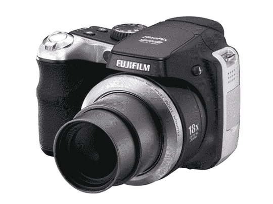
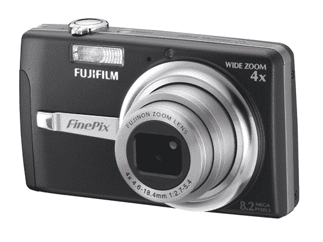
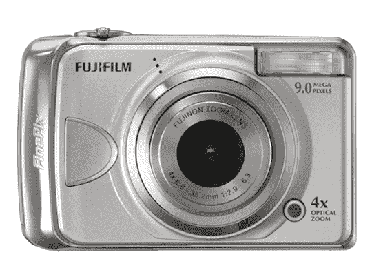
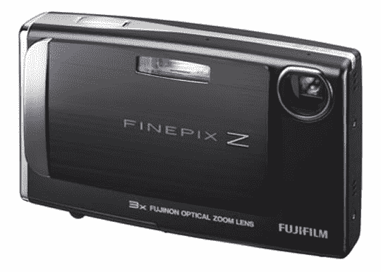
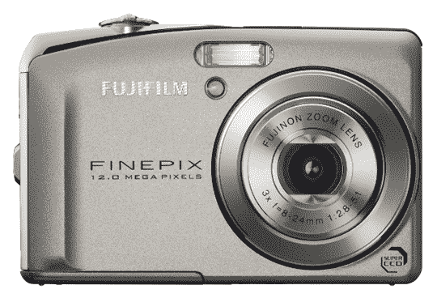

# 五款新富士相机将于 9 月上市

> 原文：<https://web.archive.org/web/http://techcrunch.com:80/2007/07/26/five-new-fuji-cameras-due-in-september/>

富士今天宣布了五款新相机，都定于 9 月份发布，价格从 179.95 美元到 399.95 美元不等。

**富士 FinePix F480: $179.95**

> F480 不比一副扑克牌大，面向寻求功能和形式的入门级摄影师。它携带了一个 820 万像素的 CCD 传感器和一个用于降噪的数字信号处理器。这种 CCD 和处理器的组合确保了 FinePix F480 拍摄的照片色彩丰富、清晰明快。世界知名镜头制造商富士龙(Fujinon)生产的 4.0 倍广角光学变焦镜头，借助 35 毫米相机上的 28 毫米-112 毫米等效镜头，可以轻松捕捉大型群体或远距离对象。

你还会发现一个 2.7 英寸的液晶显示器，图像稳定，可充电的锂离子电池，电影模式和 12MB 的内部存储器(可通过 xD/SD/SDHC 扩展)。

**富士 FinePix A920: $199.95**

> Fujifilm 的 FinePix A920 专门为首次购买数码相机的人和寻求经济实惠、易于操作的现有数码相机升级的消费者设计，具有通常为更高级型号保留的功能。该相机采用了富士标志性的超级 CCD 传感器技术，一个 4.0 倍光学变焦镜头，并配有 2.7 英寸液晶显示器。

还有 4.0 倍光学变焦、图像稳定、ISO 800 感光度、电影模式，以及内置的 IrSimple 无线图像传输支持，用于连接其他 IrSimple 兼容设备。

**富士 FinePix Z10*FD*:199.95 美元**

> 720 万像素的 FinePix Z10fd 采用超便携设计，可以轻松地将这款性感的微型迷你相机带到任何地方，它有五种鲜艳的颜色，可以搭配当今时尚人士的最新风格——波浪蓝、芥末绿、热粉色、日落橙和午夜黑。它还配备了 Fujinon 3x 光学变焦镜头、2.5 英寸 LCD 屏幕和 54MB 的内部存储器，以便在存储卡满了的时候给你一些额外的空间。凭借其令人惊叹的高分辨率液晶显示器，FinePix Z10fd 还具有富士胶片推出的全新幻灯片放映模式，让您可以观看照片，并通过提供的音乐与朋友分享照片，以帮助营造气氛。

您还可以通过自动消除红眼、IrSimple 无线图像传输、自动将图像大小调整为 640×480 或 320×240 的博客模式以及可充电锂离子电池进行面部检测。

**富士 FinePix F50*FD*:299.95 美元**

> FinePix F50fd 结合了 1200 万像素的第七代超级 CCD、3.0 倍光学变焦和 2.7 英寸高分辨率 230，000 像素广角视图 LCD，是一款紧凑的发电站，集成了用户对富士胶片更先进的数码相机的所有期望。F50fd 增加了双图像稳定、具有自动消除红眼功能的人脸检测 2.0 技术以及高达 ISO 6400 的 ISO 设置，将紧凑型数码相机提升到了一个新的水平，为用户提供了一系列新功能，使他们能够拍摄前所未有的照片。

还配有全自动控制、IrSimple 支持、博客模式、xD/SD/SDHC 兼容性和锂离子电池。

**富士 FinePix s 8000*FD*:399.95 美元**

> 这款 800 万像素、单反风格的相机具有业内固定镜头相机上最大的光学变焦之一，并引入了富士胶片最新的“双重图像稳定”，加上高达 ISO6400(50%分辨率)的 ISO 设置——所有这些功能都是高端数码相机所期望的，但价格却是消费者可以承受的。

还包括面部检测、全手动控制、高速连续拍摄、自动消除红眼、2.5 英寸液晶显示器、电子取景器，并使用 4 节 AA 电池。

所有这 5 款新相机都将于 9 月上市。