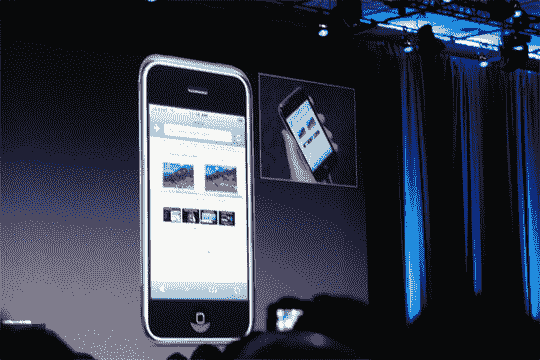

# iPhone 将改变无线行业的五种方式

> 原文：<https://web.archive.org/web/http://techcrunch.com:80/2007/06/12/five-ways-the-iphone-will-change-the-wireless-industry/>

Om Malik 一直关注着 Steve Jobs 最近在 2007 年 WWDC 大会上的主题演讲，并列出 iPhone 将改变无线行业的一系列方式。Om 提出了一些重要的观点，这些观点是我们在沉迷于 iPhone 的喧嚣时通常不会想到的。他提到，由于 iPhone 本质上也是一个 iPod，所以没有必要向第三方支付额外费用，如铃声和壁纸。想要一个新铃声？从 iTMS 下载完整的曲目或使用自己的音乐。

还提到了 iPhone 过于简单的操作系统将如何为拥挤臃肿的市场带来一些平衡和简化。没人想要一部塞满了难以使用的垃圾的手机，这是必然的。这个列表很不错，我强烈推荐点击下面的链接来获得 Om 的预测。我很确定 5 个里面至少有 4 个会实现。

[iPhone 将改变无线业务的 5 种方式](https://web.archive.org/web/20150822055033/http://gigaom.com/2007/06/12/5-ways-iphone-will-change-the-wireless-biz/)