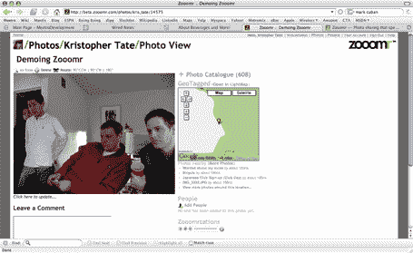
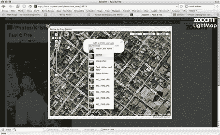
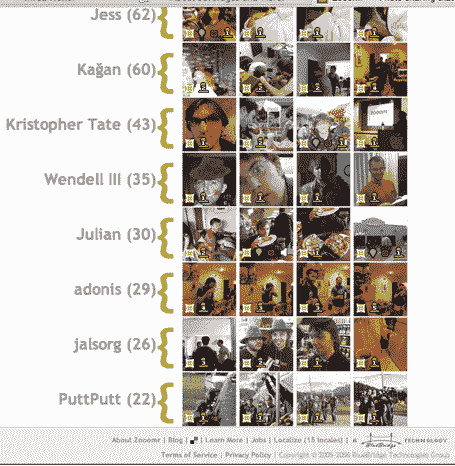

# Flickr 需要迎头赶上

> 原文：<https://web.archive.org/web/http://www.techcrunch.com/2006/04/06/the-photo-gunners/http://www.techcrunch.com/2006/03/11/flickr-has-some-catching-up-to-do/>

 克里斯多佛·泰特在上周的 [meetro](https://web.archive.org/web/20090210213930/http://www.meetro.com/) 派对上向布莱恩·奥伯基奇和我演示了他的 [zooomr](https://web.archive.org/web/20090210213930/http://www.zooomr.com/) 项目(克里斯，**17 岁**，在 meetro 全职工作，zooomr 是一个兼职项目)。他在 2006 年 3 月 1 日发布了 zooomr，在此之前他只做了大约三个月。他建立的是一个类固醇的 flickr。

Zooomr 的界面和 flickr 相似，但功能更多。你可以选择创建一个帐户，或者只使用其他五种证书之一来设置帐户(Level9、OpenID、LiveJournal、Google (Gmail)或 Meetro。功能是相同的。Zooomr 还提供 15 种语言的网站。

zooomr 的真正好处是可以与照片相关联的各种各样的元数据。任何照片都可以有音频注释，尽管录制功能尚未内置到 zooomr 中，因此您必须从您的相机或音频程序中进行录制，并单独上传。Zooomr 有一个内置的 flash 播放器来听注释。你还可以将任何人与照片相关联(这在 flickr 上是做不到的，在 Flickr 上，如果你愿意，你只能用一个人的名字来标记照片)，并且与谷歌地图有非常紧密的集成，允许地理信息包含在照片中。如果大量照片同时在特定地点被地理标记，zooomr 会假设它们是事件的一部分，即使这些照片都来自不同的用户。

最后，要查看任何照片的放大图，只需点击照片中的灯箱，它就会立即以更大的尺寸弹出。

有关功能的更多详细信息，请查看 zooomr " [了解更多信息](https://web.archive.org/web/20090210213930/http://beta.zooomr.com/learn_more)"区域。该网站每月免费上传 50 mb 的照片，每月 2 GB 的费用为每年 20 美元(类似于 flickr，但便宜 5 美元)。

更新: [Ouriel](https://web.archive.org/web/20090210213930/http://ouriel.typepad.com/) (撰写 [TechCrunch France](https://web.archive.org/web/20090210213930/http://fr.techcrunch.com/) 的作者)刚刚向我推荐了 Flickr 的新产品 [ZoneTag](https://web.archive.org/web/20090210213930/http://zonetag.research.yahoo.com/zonetag/) ，该产品可以对从手机上传的照片进行自动地理标记。这是一个很棒的功能。

