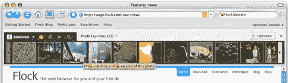

# Flock 筹集新一轮风险投资，推出公开测试版

> 原文：<https://web.archive.org/web/http://www.techcrunch.com:80/2006/06/13/flock-raises-new-venture-round-launches-public-beta/>

总部位于硅谷的 Flock 发布其基于 Firefox 的浏览器的开发者版本已经将近八个月了。今天晚上，他们将在 Flock.com[发布他们的第一个公开测试版，适用于 Windows、Mac 和 Linux 机器。过去几周，我一直在我的 Mac 上运行最新的开发者版本，它现在是我的首选浏览器。](https://web.archive.org/web/20220816075701/http://www.flock.com/)

昨晚，我采访了 Flock 创始人 Bart Decrem、Geoffrey Arone 和 Anthony Young，以及来自 Shasta Ventures 的投资人 Jason Pressman。讨论的播客在 TalkCrunch 上发布。

Flock 是一个基于 Mozilla 的浏览器(参见 [Songbird](https://web.archive.org/web/20220816075701/http://www.beta.techcrunch.com/2006/02/07/songbird-to-launch-tonight/) ，另一个基于 Mozilla 代码的应用程序)。他们在 Firefox 的核心代码基础上增加了额外的功能，使浏览体验更加无缝，包括与 Flickr 或 photobucket 的照片集成，与 Del.icio.us 或 Shadows 的社交书签集成，博客工具，增强的搜索和 RSS 阅读器。

**照片**

存储在 Flickr 或 Photobucket 中的照片直接集成到浏览器体验中，在浏览器窗口上方水平滚动。照片可以通过拖到浏览器上传到这些帐户。或者，通过将照片直接拖到网页中，可以将照片添加到任何接受 html 的网页中(例如，博客上的评论区)。这是我转而使用 Flock 的一个最有说服力的原因——把我的 Flickr 照片放到桌面上。

目前支持 Photobucket 和 Flickr。随着时间的推移，将会有更多的照片服务被整合进来(例如，我已经建议也支持 CNET 的 AllYouCanUpload)。

**书签**

Flock 还与 Del.icio.us 和 Shadows 社交书签帐户紧密集成。点击地址栏旁边的星号按钮可以将当前页面加入书签，还可以添加标签等元数据。随着时间的推移，将会支持更多的书签网站。

**博客、搜索、RSS**

 Flock 有一个集成的博客工具，带有集成标签，可以与大多数主要的博客平台兼容。用户可以在预览和 html 视图之间切换。默认情况下，通过右上角的下拉菜单(与 Firefox 在同一个位置)搜索被设置为 Yahoo，然后被更改为 Google、Technorati、Wink 等。(不支持 MSN 或 Live.com 搜索)。开始键入搜索查询会弹出一个框，显示最近加入书签的网站、访问过的网站和默认搜索引擎的搜索结果。

集成的 RSS 阅读器非常出色(左上图)。任何访问过的带有提要的网页都会在地址栏中显示橙色提要图标。点击它会显示提要的预览。再点击一下，你就订阅了。在阅读器中，订阅源可以单独阅读，也可以以“新闻之河”的方式阅读。

Flock 的大部分收入将来自搜索栏，就像 Firefox 一样。他们与搜索提供商就通过浏览器完成的搜索达成收入分成协议。我所听到的低端估计表明，Firefox 每年为每个用户带来至少 2-3 美元的收入。Flock 还将向直接集成到浏览器中的服务提供商收费，并计划与合作伙伴推出联合品牌的浏览器以增加分销。鉴于他们与雅虎的密切关系(search、del.icio.us 和 flickr 整合)，我不会对今年某个时候发布雅虎版本的 Flock 感到惊讶。

Flock 还获得了由 Shasta Ventures 牵头的新一轮融资，据传金额在 1000 万美元左右。之前的投资者包括 Bessemer Venture Partners 和 Catamount Ventures。