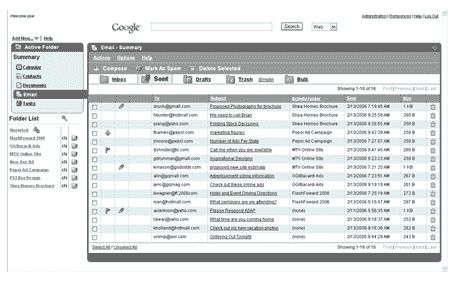
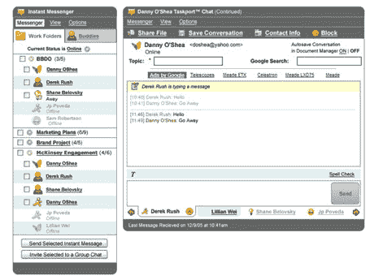
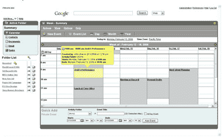

# Foldera:再也不用整理你的收件箱了

> 原文：<https://web.archive.org/web/http://www.techcrunch.com:80/2006/02/20/foldera-never-organize-your-inbox-again/>

  总部位于加州亨廷顿海滩 [Foldera](https://web.archive.org/web/20220628130510/http://www.foldera.com/) 的目标是组织所有围绕工作的混乱文档(电子邮件、日历、办公文档、即时消息等)。这是一个非常大的想法。

该公司目前正处于私人测试阶段，全面发布正在进行中。

Foldera 的生产力方法与我们使用 Outlook today 等应用程序的方式直接冲突(想想我们都花了多少时间来整理收件箱、归档电子邮件等。).Foldera 有一个更好的方法(现在我已经看到了一个非常明显的方法)，他们有机会严重破坏即将推出的产品，如微软的 [Office Live](https://web.archive.org/web/20220628130510/http://www.beta.techcrunch.com/tag/Office-Live/) 。

今天，我们大多数人都习惯于使用电子邮件文件夹，电子邮件可以简单地放入一个文件夹中，以便以后更容易发现。围绕 Foldera 的想法始于此。他们创建了一个 Ajax 富 web 应用程序，将电子邮件、日历、即时消息、文档存储和版本控制、任务和其他功能集成到一个 web 应用程序中。一切都以文件夹为中心:

> 这是如何工作的？
> 
> 您可以为每个不同的项目或活动创建一个专用的活动文件夹。电子邮件、即时消息和所有其他应用程序现在都可以从该文件夹中访问，而不是原来的断开连接和非结构化状态。这种组织结构也使一切保持在上下文中；例如，您所有的电子邮件对话和即时消息对话都保存在特定的活动文件夹中，因此与该项目相关的所有内容都保存在一起。这不是更有意义吗？
> 
> 你和其他人一起工作吗？
> 
> 要真正体会 Foldera 的功能，请尝试在团队中使用它。你用 Foldera 创建的一切都可以在一个团队的一个、几个或所有成员之间共享或私有、委托、拥有或分发。与一些协作应用不同，Foldera 易于使用，几乎不需要学习。如果能发邮件，可以用 Foldera。

Foldera 的首席执行官 Richard Lusk 去年年底会见了我，向我展示了该产品的早期演示。这个想法是你在任何新项目周围创建一个文件夹。与其他人共享该文件夹或保持其私密性。[文档](https://web.archive.org/web/20220628130510/http://www.foldera.com/documentmanager.htm)可以上传到服务并与文件夹关联。[从文件夹中启动的电子邮件](https://web.archive.org/web/20220628130510/http://www.foldera.com/email.htm)会自动与项目相关联。与[日历](https://web.archive.org/web/20220628130510/http://www.foldera.com/calendar.htm)条目相同。Foldera 还包括一个[即时消息](https://web.archive.org/web/20220628130510/http://www.foldera.com/instantmessenger.htm)应用程序(它可以与 MSN Messenger、Google Talk、AOL Instant Messenger (AIM)、iChat 和 Yahoo Messenger 配合使用)。

将电子邮件、即时消息副本、办公文档、日历项目等自动组织到共享或私人文件夹中是一件大事。在一个地方查看每个相关文档将节省时间。随着截止日期的临近，用户可以只关注项目文件夹，而忽略处理其他项目的分散注意力的电子邮件和即时消息。

定价尚未透露，但将有一个慷慨的免费选项。

Foldera 自推出以来已经筹集了 1300 万美元。上周，该公司完成了对一家现有(壳)上市公司的反向收购，额外融资 850 万美元。它现在是一家上市公司，市值 7000 万美元。是的，这太疯狂了——他们甚至还没有发布。

## 屏幕截图

