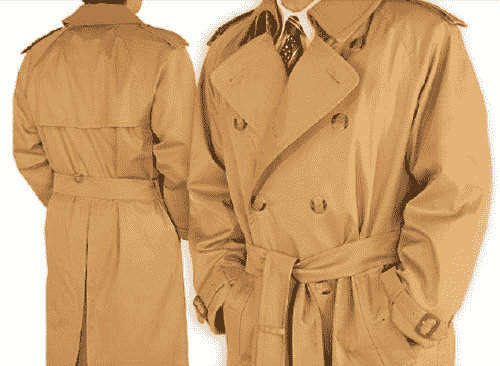

# Fortier & Co .生产时尚防弹衣

> 原文：<https://web.archive.org/web/http://techcrunch.com/2007/06/21/fortier-co-makes-stylin-body-armor/>

那些有志成为说唱艺术家的读者应该密切关注。Frontier 公司与博柏利、YSL、肯尼斯·科尔等大牌服装设计师合作。设计出与你的服装自然融合的防弹衣。就拿这件漂亮的博柏利风衣来说吧。它使用的防弹纤维比钢更坚固，但重量很轻，可以保护你免受迎面而来的子弹。它也是一件非常漂亮的外套。

不幸的是，保护和风格并不便宜。前面提到的外套基本款要花掉你 2195 美元。这意味着，如果你担心被 AK-47 干掉，你可能会花很多钱。

福捷公司防弹衣