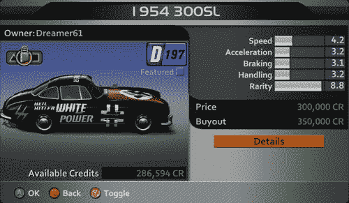

# Forza 2 汽车喷漆功能滥用:有些人有太多的自由

> 原文：<https://web.archive.org/web/http://techcrunch.com/2007/07/03/forza-2-car-painting-feature-abuse-some-people-have-too-much-freedom/>

# Forza 2 汽车喷漆功能滥用:有些人有太多的自由

*Forza 2* 是一款 360 度的游戏，让你建造并喷涂自己的汽车，并在游戏中进行比赛。很公平。不幸的是，一些游戏玩家自己创造了纳粹主题的跑车和其他明显的种族主义垃圾。

虽然每个人都有言论自由的权利，但像这样的事情只会破坏 360 度体验，滋生无知和蔑视。我不认为他们应该审查它——它确保了种族主义混蛋在直播中被开除和禁止，这对每个人都有好处。我们将在接下来的几天里看看他们会做什么。实际上很有趣的是，更多的这种情况并没有发生在 WoW 等人身上，或者也许我只是没有看到。

[微软尚未超越《极限 2》的种族主义](https://web.archive.org/web/20130628165535/http://www.360-gamer.com/news.asp?id=1173)