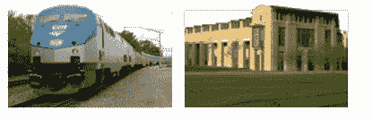
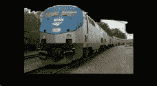
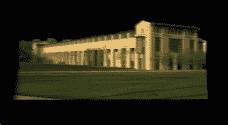

# Fotowoosh 将把任何图片变成 3D 图像

> 原文：<https://web.archive.org/web/http://www.techcrunch.com:80/2007/04/15/fotowoosh-will-turn-any-picture-into-3d-image/>

 

总部位于马里兰州的初创公司 [Freewebs](https://web.archive.org/web/20220627093858/http://www.freewebs.com/) 推出的新服务 Fotowoosh[，可以将任何图像(最好是户外图像)转换成 3D 模型。他们于周五上线。该服务可以做什么的例子在上面(以及原始的 2D 图片。一个视频是](https://web.archive.org/web/20220627093858/http://fotowoosh.com/)[这里](https://web.archive.org/web/20220627093858/http://members6.freewebs.com//player.swf?&autoplay=1&r=0.9944167258848078&page=http://www.fotowoosh.com/test.htm&pv=1.0&file=5498588)展示了更多的例子。

3D 图像是以虚拟现实建模语言(VRML)格式构建的，这意味着您目前需要一个 VRML 阅读器来查看它(未来的浏览器可能会在中内置此功能)。该公司表示，在一周左右的时间内，用户将能够上传一张图片，并在一个可以嵌入任何网站的 Flash 小工具中获得 3D 动画图像。

当你上传一张照片到 Fotowoosh 时，他们的软件会将照片拆开，区分照片中的天空、地面和垂直元素，然后将其剪切并折叠成 3D 模型:

> 我们的系统从一张户外图像中自动构建简单的“弹出”3D 模型，就像人们在儿童书籍中看到的那样。系统将户外图像的每个区域标记为地面、垂直或天空。符合图像中地面垂直边界的线段和对地平线位置的估计提供了必要的信息，以确定图像中的“切割”和“折叠”位置。然后弹出模型，图像被纹理映射到模型上。

这是德里克·霍伊姆的发明，他是卡内基梅隆大学的机器人学博士生，现在正在该公司工作。关于 Fotowoosh 背后的知识产权的其他信息是[这里](https://web.archive.org/web/20220627093858/http://www.cs.cmu.edu/~dhoiem/presentations/Toward%203D%20Scene%20Understanding.ppt)和[这里](https://web.archive.org/web/20220627093858/http://www.cs.cmu.edu/~dhoiem/publications/hoiem_ijcv06.pdf)(这些链接自动下载 pdf 和 powerpoint 文档)。

微软正在他们名为 [Photosynth](https://web.archive.org/web/20220627093858/http://research.microsoft.com/IVM/PhotoTours/) 的 Live Labs 组中研究与此相关的东西(更多信息[在这里](https://web.archive.org/web/20220627093858/http://research.microsoft.com/IVM/PhotoTours/))。该产品将基于同一事物或一般区域从不同角度拍摄的大量照片构建一个 3D 模型。

2006 年 8 月，Freewebs 从 Columbia Capital 和 Novak Biddle 那里获得了 1100 万美元的风险投资。该公司的主要产品是一个网站建设工具，每月吸引 1800 万左右的访问者。该公司总裁 Shervin Pishevar 表示，Fotowoosh 将是一项独立的服务，他们还将把它与合作伙伴的产品以及免费网络服务本身集成在一起。