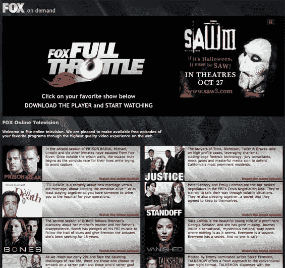

# MySpace 进入黄金时段| TechCrunch

> 原文：<https://web.archive.org/web/http://www.techcrunch.com:80/2006/10/03/fox-expands-free-tv-offering>

福克斯正在[扩张](https://web.archive.org/web/20230222184512/http://www.topix.net/content/reuters/0833767685165589097431900507201725449171)它正在全力提供电视节目(见[福克斯向互联网](https://web.archive.org/web/20230222184512/https://techcrunch.com/2006/08/21/fox-streams-more-tv-to-internet/)传输更多电视节目)。与以前的主要区别似乎是，福克斯现在通过 MySpace 和 24 个当地附属网站分发节目(这是一个痛苦，因为如果你不住在洛杉矶这样的覆盖地理区域，你必须编造一个物理地址)。

这些节目可以在这个 MySpace 页面上看到。

可供选择的节目包括《识骨寻踪》、《越狱》、《对峙》、《消失》、《斯派克·费雷斯滕脱口秀》、《直到死亡》、《循环》和《正义》等。

节目将以高清晰度播放，而且是免费的，尽管包括不可跳过的广告。用户将被要求下载一个播放器来观看内容。

