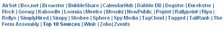

# 福克斯宣布收购；独家视频 TechCrunch

> 原文：<https://web.archive.org/web/http://www.techcrunch.com/2006/03/02/fox-interactive-announces-acquistion/>

# 福克斯宣布收购；独家视频

今天下午，我在的[秘密活动中接受采访时，**福克斯互动公司的总裁罗斯·莱文索恩宣布，他们已经收购了出席**活动的 32 家公司中的一家。然而，他不愿透露是哪家公司。](https://web.archive.org/web/20230216130746/http://undertheradarblog.com/web-20-beyond-the-bubble/)

新闻集团(News Corp .)旗下的福克斯互动(Fox Interactive)去年以 13 亿美元收购了包括 MySpace 在内的三家公司。他们还为未来的收购预留了 20 亿美元。

罗斯还表示，如果“福克斯很快收购了房间里的至少五家公司”，他不会感到惊讶。 [Dan Farber 是第一个写这个](https://web.archive.org/web/20230216130746/http://blogs.zdnet.com/BTL/?p=2648)的人，他向 Ross 证实了这不是 MySpace 的竞争对手标记的。范围缩小到了 31 个目标:

以下是采访的独家视频片段(由 Keith Teare 拍摄)。第一个片段是罗斯说他在房间里找到了一个人。第二个是他的声明，他们可能会在不久的将来收购 5 家公司的镜头。

【YouTube http://www.youtube.com/watch?v=IAzkNP3c0zQ]

[YouTube http://www.youtube.com/watch?v=fdFbkcL1MgY]