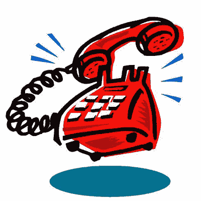

# 免费电话:如果可以免费获得，为什么要付费？TechCrunch

> 原文：<https://web.archive.org/web/http://techcrunch.com/2007/08/02/free-phone-calls-why-pay-for-something-if-you-can-get-it-for-free/>

我们是小气鬼，人们总是试图找到交易，比如说，可以免费打电话。是的，那行得通。在《泰晤士报》上，大卫·波格勇敢地查看了几种以某种方式提供免费电话的服务。 [Skype](https://web.archive.org/web/20150805144344/http://crunchgear.com/category/skype/) 我们已经知道了，所以谁在乎呢。但是还有三项服务看起来不错:[Jajah.com](https://web.archive.org/web/20150805144344/http://jajah.com/)，T-Mobile 的 HotSpot@Home 和 [Ooma](https://web.archive.org/web/20150805144344/http://www.ooma.com/ooma_faq.php) 。

Jajah 允许你用普通电话打电话，但是你需要用网络浏览器发起对话。然后 Jajah 给两个号码打电话，把它们连接起来，有点像接线员。

约翰目前正在度假，他已经对 T-Mobile 的 HotSpot@Home 竖起了大拇指。基本上，它允许 Wi-Fi 通话。

Ooma 是所有这些服务中最有意思的，因为它试图“战胜”电话公司。Ooma 利用了所有本地电话都是免费的这一事实，而不管电话供应商是谁。Ooma 给每位顾客一个特殊的转换盒，所以当你打长途电话时，你实际上是连接到你要打电话的地区的 Ooma 盒上。据电话公司所知，这个电话是从那个遥控盒发出的。即时免费通话。(你住在旧金山，打电话到纽约。Ooma 连接到纽约的一个盒子上，然后这个电话，实际上，看起来像是从纽约本地打来的。)

所以，是的，你可以免费给你的朋友和敌人打电话，但这可能不是最简单的流程。

另一件事:有人能告诉大卫·波格，他在《纽约时报》上愚蠢的小视频一点都不好笑吗？就像，他们一点都不可笑。把喜剧留给喜剧演员吧，大卫。

[在这里获得免费网络电话](https://web.archive.org/web/20150805144344/http://www.nytimes.com/2007/08/02/technology/circuits/02pogue.html?pagewanted=1&8dpc&_r=1)【纽约时报】