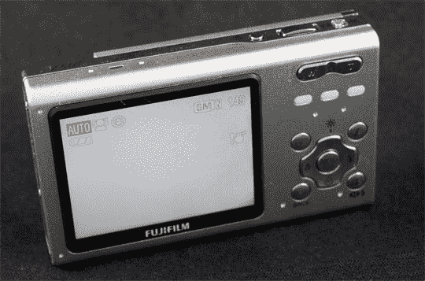

# 富士 Z5fd 评论

> 原文：<https://web.archive.org/web/http://techcrunch.com:80/2007/06/08/fujifilm-z5fd-review/>

几年来，我一直在观察前胶片相机制造商如何努力在数码相机市场分一杯羹，在这个阶段，我印象相当深刻。以富士胶片为例。这家前巨头长期以来以其出色的胶片和照片而闻名，但在保持偿付能力的同时，不得不与佳能(Canon)和尼康(Nikon)等数码忍者竞争。

在过去的一年里，我尝试了一些富士相机，看到了一些令人失望的表现。然而，我很高兴地说，Z5fd 又名“博客的相机”是超小型傻瓜相机市场的有力竞争者。

Z5fd 是一款 630 万像素的相机，具有 3 倍光学变焦和 2.5 英寸的屏幕。当您向后滑动前面板时，它几乎立即打开，大约有 2 秒钟的延迟。前面有一个小 Z5，当你打开相机或拍照时，它就会亮。我把胶带巧妙地放在商标上，很方便地解决了这个问题。

Z5fd 上的面部检测非常准确，非常适合聚会拍摄。我带着这个相机去参加一个婚礼，当图像没有被闪光灯冲掉时，集体照看起来还不错。Z5 支持 ISO 1600，可在弱光下更快拍摄，并包括图像稳定功能，可人为防止照片模糊。它还有一个智能闪光灯系统，可以减少曝光和闪光灯功率，使图像在奇怪的照明情况下看起来不那么模糊。

用 Z5 拍摄的图像相当明亮和详细，只有一点点模糊区域。我打印出了一些图像，没有看到明显的异常问题，但图像在自然光下略有褪色。

一个有趣的花絮:Z5 有博客模式。这只是一种为每个图像创建较小副本的模式，允许快速上传到博客和其他共享服务。了不起。它肯定不会比“婴儿”模式更好，这是有史以来最好的模式。这是给婴儿的。

Z5fd 售价 229 美元，有三种颜色。它采用 Xd 卡，没有包括在内，并有 26MB 的板载内存。是不是很棒的相机？不。这是一个熟悉它的公司生产的可接受的便携式相机吗？是的。

[产品页面](https://web.archive.org/web/20140824181240/http://www.fujifilmusa.com/JSP/fuji/epartners/PRNewsDetail.jsp?DBID=NEWS_861802)