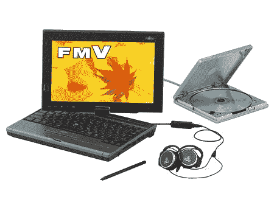

# 富士通推出四款新笔记本电脑——TechCrunch

> 原文：<https://web.archive.org/web/http://techcrunch.com:80/2006/08/29/fujitsu-drops-four-new-laptops/>

# 富士通推出四款新笔记本电脑

我不是说他们真的掉了四台笔记本电脑，那就糟了。实际上，虽然我想知道有多少笔记本电脑在生产和销售过程中被丢弃和毁坏。有人知道数字吗？糟糕，我跑题了。

富士通今天宣布发布四款新的笔记本电脑到它的 Biblio 和 LOOX 系列。令人惊讶的是，这些系统都没有配备 Merom，但其中一个配备了双核 AMD 芯片。NF60T 由 AMD 1.67GHz Turion 64 X2、512MB 内存和 100GB 硬盘驱动，两者都有 15.4 英寸的液晶显示屏。NF40T 拥有英特尔 1.46GHz 赛扬 M 410、512MB 内存和 80GB 硬盘。每台机器都有 WiFi、Firewire、USB 2.0、千兆以太网、PCMCI 和 ExpressCard。

另外两个系统是 LOOX Q 和 LOOX P70T/V。每个系统都有一个 12.1 英寸 WXGA LCD，由 Core Solo U1400 1.2GHz 处理器驱动，具有 512MB RAM、30GB 硬盘、WiFi 和蓝牙 2.0。唯一的区别是，P70T/V 是一款平板电脑，配有 Windows Tablet PC Edition 2005。

[富士通推出四款新笔记本](https://web.archive.org/web/20210126023514/http://www.engadget.com/2006/08/29/fujitsu-drops-a-quartet-of-new-notebooks/)