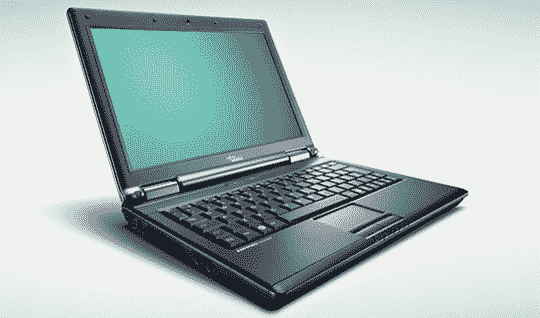

# 富士通西门子新型 3G 笔记本电脑| TechCrunch

> 原文：<https://web.archive.org/web/http://techcrunch.com/2007/07/09/fujitsu-siemens-new-3g-enabled-notebooks/>

从 8 月份开始，您将能够获得富士通西门子新推出的集成 3G 功能的 ESPRIMO 笔记本电脑。除了由于集成的 3G 芯片而几乎无处不在的连接，当使用可选的第二块电池时，你还可以从这些装备中挤出大约 10 个小时(据富士通称)。

它们将有三种不同的型号——4 磅重的 12.1 英寸轻薄型，4.6 磅重的 14.1 英寸，以及 5.5 磅重的 15.4 英寸台式电脑。每台设备都包括 Windows Vista Business、英特尔迅驰 Core 2 Duo 处理器和非常少的视觉吸引力(这是可以理解的，因为它是一台商用笔记本电脑)。

如果你能够配备一个更轻的型号，并且第二块电池不会让你太沉，那么 10 个小时的 3G 可能会成为海滩上富有成效的一天。

8 月初上市，尚未定价。

[富士通西门子 ESPRIMO 系列](https://web.archive.org/web/20150930103041/http://www.fujitsu-siemens.com/products/mobile/notebooks/index.html)