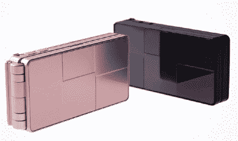
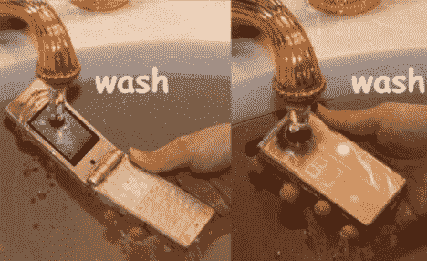

# 富士通的轻薄防水 F703i——TechCrunch

> 原文：<https://web.archive.org/web/http://techcrunch.com:80/2007/02/01/fujitsus-thin-waterproof-f703i/>

# 富士通轻薄防水的 F703i

在日本，被人轻薄一定是在(哈！)因为 F703i 是现在世界上最薄的防水手机。为 NTTDoCoMo 发布的这款手机厚度仅为 0.7 英寸，重量仅为 3.8 盎司。功能包括 2.2 英寸 QVGA TFT 显示屏，多种水果色，microSD，130 万像素摄像头和 10 万像素视频摄像头，用于视频通话。哦，是的，它完全防水。

手机可以浸泡在水中，冲洗，或完全淹没长达半个小时。太糟糕了，我们美国人不会很快看到它，否则当我和乔希去裸体海滩时，我会得到一个。

[富士通推出全球最薄防水手机](https://web.archive.org/web/20210227164548/http://www.laptoplogic.com/news/detail.php?id=2014)【笔记本电脑逻辑】