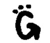

# Gada.be - Tag 元搜索完成正确 TechCrunch

> 原文：<https://web.archive.org/web/http://www.techcrunch.com:80/2005/10/10/gada-tag-meta-search-done-right/>

**Company:** [Gada](https://web.archive.org/web/20221003042233/http://www.gada.be/) **Launched:**

2005 年十月十日

**Founder:** [Chris Pirillo](https://web.archive.org/web/20221003042233/http://chris.pirillo.com/blog/_archives/2005/10/10/1291817.html) **Location:**

华盛顿州西雅图

今天，克里斯·皮里略发布了[gada . be](https://web.archive.org/web/20221003042233/http://www.gada.be/)——一个强大的标签元搜索引擎，其设计非常简单和周到。Shayne Sweeney 是建造 Gada 的开发者。

Gada 获取一个查询，并在 Google News、Technorati、Flickr、IceRocket、Amazon、Wikipedia、43Things 等网站上运行。搜索可以通过下拉框缩小到“照片”、“社交”等。更多具体结果。搜索本身，以及任何缩小，也是通过域名完成的。例如，对“web2con”的照片搜索，人们在上周的 web2.0 会议上使用的标签，也是通过 URL[web2con.gada.be/p](https://web.archive.org/web/20221003042233/http://web2con.gada.be/p)完成的。查询是子域，照片过滤器是末尾的/p。

允许简单的搜索和通过域名结构过滤是聪明的，并允许非常强大的移动搜索。还要注意的是,“Gada”这个名字很容易在手机的数字键盘上输入。

> 这是几次挫折的结果。如果你曾经试图通过移动设备访问一个网站，你就会知道这是一件痛苦的事情。该域名必须易于从任何地方键入。gada.be 在大部分手机和 PSP 上都是 4232.2233。通常，当你想在网上找东西时，你必须选择一个网站(等待页面加载)，输入查询(等待第二个页面加载)，然后查看来自该提供商的结果。使用“gada.be”，您可以将查询*作为*子域插入！
> 
> 然后，为了得到你想要的结果，你不得不访问几个网站。通常，当你在路上时，这是不可行的。即使当你坐在笔记本电脑前或被束缚在台式机前，这仍然是一个耗时的过程。我们都喜欢个性化的搜索服务，为什么不把它们结合在一起呢？好吧，我们就是这么做的。此外，我们动态地输出 OPML，您可以将它导入您最喜欢的新闻聚合器。gada.be 为每个人节省时间！

Gada 很可能会成为一个有很多链接的网站，提供一个术语的最终结果，就像今天的维基百科一样。Gada 将所有相关信息合并到一个永久的 URL 中，因此成为一个标签链接的综合结果集。Gada 还以 RSS 和 OPML 的形式输出搜索结果，允许用户轻松订阅和组织搜索。

关于 Gada 的更多信息请访问他们的[关于页面](https://web.archive.org/web/20221003042233/http://gada.be/about)。