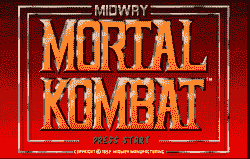
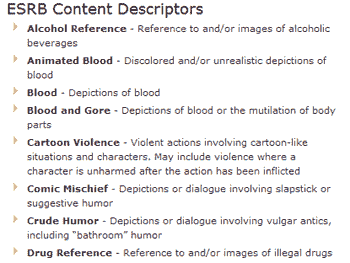

# 显微镜下的游戏内容:ESRB 评级 TechCrunch

> 原文：<https://web.archive.org/web/http://techcrunch.com/2007/05/14/game-content-under-the-microscope-esrb-ratings/>

*本周，我们在对业内人士的一系列采访中探讨了视频游戏暴力和内容的问题。这是一个棘手的问题，因为可能冒犯一个人的事情不会让另一个人感到惊讶。对一个游戏玩家来说可能是好的内容可能真的会扰乱另一个。这就是收视率应该澄清的地方。*

今天，所有主要的视频游戏版本都会得到 ESRB(电子软件评级委员会)的评级。娱乐软件协会(ESA)于 1994 年成立了这个非盈利、自我监管的机构，正是这个组织分配计算机和视频游戏内容分级并执行行业采用的广告准则。
 根据 ESRB 的说法:
“评级系统是自愿的，尽管几乎所有在美国和加拿大零售的游戏都由 ESRB 进行评级。包括大多数大型连锁店在内的许多零售商都有政策，只库存或销售带有 ESRB 评级的游戏，大多数游戏机制造商只允许在他们的平台上发布经过 ESRB 评级的游戏。”

关于评级如何运作以及如何确定的信息可以在 ESRB 网站上找到。

然而，正如我们已经提到的，收视率是在 1994 年制定的，部分是由于游戏的内容，如*真人快打*。当时有两个主要的主机玩家，包括任天堂和 SEGA，从那时起，我们已经看到了三代硬件的改进。是时候重新审视收视率了吗？

在为期一周的视频游戏内容系列的第一部分中，Crunchgear 采访了 ESRB 发言人 Eliot Mizrachi:

**Crunchgear:** 自从 1994 年引入分级以来，图形细节大大增加，因此游戏看起来更真实。这一点是否被考虑过，至少在游戏分级是否应该被重新处理的问题上？1994 年的游戏看起来比今天的游戏更像卡通，更接近照片级的真实，所以这是在考虑中吗？

图片的细节和真实程度一直是，也将继续是评分者考虑的因素之一，其他因素包括玩家控制程度、奖励系统、背景和整体强度。

**CG:** 就暴力和性而言，我知道 AO(仅限成人)分级是为“可能包含长时间激烈暴力场景和/或图形性内容和裸体”(ESRB 网站)的游戏而设立的。但是到目前为止，有没有哪本书因为暴力或者更重要的题材获得过 AO 评级？

绝对是。我们对 AO 游戏的色情、极端暴力或其他类型的成人内容进行了评级，如真实的赌博。需要指出的是，我们分配 AO 等级的次数多于它实际上作为最终等级的次数。发行商总是可以选择修改他们的游戏内容，并重新提交给 ESRB，他们经常这样做是因为一款带有 AO 评级的游戏获得广泛发行的能力有限。

事实上，AO 的分级是否在某种程度上变得类似于 NC-17 的电影分级，在 NC-17 的电影中，它仍然被认为是色情内容？

与其他内容相比，露骨的性内容可能更容易导致 AO 评级，这一判断仅仅反映了我们的文化规范和社区标准。然而，AO 分级旨在传达这样一种信息，即游戏中的内容超出了年轻人在社会或文化上通常可以接受的范围，而且无论是什么年龄的儿童，无论是否涉及性内容，都肯定无法接受。此外，应该注意的是，内容不需要被限定为“色情”或淫秽来保证 AO 分级分配。在这方面，我们的 AO 等级与 NC-17 等级没有区别。

**CG:** 讨论题材，剧情、人物、游戏总体目标的界线划在哪里？我的例子:使命召唤系列被评为青少年，但是二战系列被评为成人。不同的似乎是对血的描绘和一些刺耳的语言。但是 *Doom3* 也被评为成熟，这似乎更加暴力和生动，最后 *Scarface* 也是成熟的。这款游戏的特色是一个毒贩子，作为“获胜”过程的一部分与执法部门作战，并能够随机殴打无辜的人。

所以我的问题是，什么是成熟，什么可能被认为是成年人的界限在哪里？

只有六个分级类别，我们显然要为每个年龄适当性分组处理不同程度的强度。当指定一个成熟的等级时，我们的评分者认为该游戏的内容和背景最适合 17 岁及以上的人。显然没有两个游戏是完全相同的，所以一个游戏总是存在于给定类别的某个地方。这就是内容描述符如此方便的原因。

举个例子来说， *Doom3* 被评为成熟，描述了“血腥”和“激烈的暴力”，而 *Scarface* 除了“性主题”、“强烈的语言”和“使用毒品”之外，还有这两个描述额外的描述符表明了每个游戏中内容的差异，这就是为什么我们鼓励父母在选择游戏时使用系统的两个部分。

当一个成熟的分级被指定时，我们相信它传达了一个足够强烈的警告:一个特定的游戏通常不适合儿童。因此，为了使游戏获得 AO 分级，它必须包含超出一般认为适合年轻人的内容，并且对于任何年龄的儿童来说都是不可接受的。最终，这是我们的评分者基于各种因素做出的判断，我之前也提到过。此外，Peter D. Hart Research Associates 定期对 400 多名家长进行的研究表明，绝大多数时候，家长同意我们的成熟评级作业。最后，还值得一提的是，联邦贸易委员会最近发布的关于向儿童销售暴力娱乐的报告发现，88%的家长认为 ESRB 在告知他们游戏中的暴力内容方面做得“出色”、“良好”或“一般”。

虽然酒精和药物的使用有描述，但这并没有真正定义酒精和/或药物是由玩家角色还是非玩家角色使用。在评级过程中，这一点是否被考虑在内？我问的是在上下文中是否考虑了酒精描写？例如，如果你玩一个以埃利奥特·内斯的生活为基础的游戏，你正在执行禁酒令，而在另一个游戏中，你是一个酗酒的强盗？

 **EM:** 我们对烟草、酒精和毒品的“使用”以及这些物质的“引用”都有描述。“参考”描述符更可能属于描述或对话，而无论是玩家还是游戏中的另一个角色,“使用”描述符恰恰需要这样。在分配等级时，描述的上下文总是一个考虑因素。例如，在宗教仪式中啜饮圣餐酒的上下文描述可能不保证“使用酒精”描述符，而你的“酒精流氓”的饮酒习惯更有可能。当然，内容描述符是在所分配的分级类别的上下文中分配的，因此例如 E 级游戏中的这种描述比 M 级游戏中的这种描述更有可能产生描述符，M 级游戏中的这种描述可能包括关于可能引起更大关注的其他类型内容的警告，对玩游戏的整体体验以及所分配的分级类别具有更大的影响。

**CG:** 我可以证明，当我问游戏开发商/制作人他们是否认为任何 18 岁以下的孩子都应该玩某个游戏时，我听到的是，“嗯，我们认为这是成年人的游戏。”所以我要问了，那为什么不评为 AO 呢？

人们总是认为，评级应该根据他们个人的观点或多或少地受到限制。回到我之前说的，82%的时候家长同意我们的评级，另外 5%认为我们太严格了。绝大多数时候，家长也同意成熟的评级作业。联邦贸易委员会最近的报告还发现，家长们相当赞同 ESRB 的评级，87%的家长表示他们对我们的评级“非常”到“有些”满意。鉴于这个国家的价值观和观点的多样性，这些都是重要的一致和满意程度，我们非常致力于确保我们的评级反映消费者对内容的期望。但是到了最后，不管你给这些游戏定的是 M 级还是 AO 级，它们都被贴上了不适合年轻人玩的标签，差别其实只是强度或极端程度的问题。

我认为可以肯定地说，大多数出版商会反对 AO 评级，因为它会使销售更加困难，但是考虑到我已经讨论过的因素，例如更真实的图形，你是否预见到这个评级在某个时候可能对更生动的暴力描写是必要的？

即使是暴力或其他与性无关的内容，ESRB 也毫不犹豫地对其进行分级，这一点我怎么强调都不为过。预测未来是不可能的；我们所能做的就是继续分配评级，为消费者提供可靠的指导，并告知他们的购买决定。