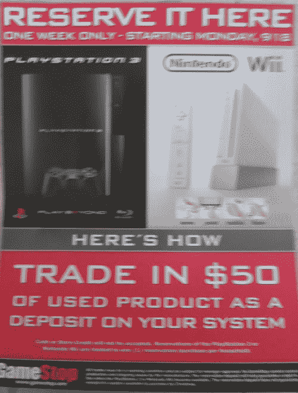

# Gamestop PS3 和 Wii 预购

> 原文：<https://web.archive.org/web/http://techcrunch.com/2006/09/17/gamestop-ps3-and-wii-preorders/>

[Kotaku](https://web.archive.org/web/20140916032830/http://kotaku.com/) 在 Gamestop 海报上获得独家新闻，宣布 PS3 和 Wii 的预订。根据海报，客户可以交 50 美元的二手产品来预订其中一个系统。Kotaku 认为这可能是通过 Gamestop 预订系统的唯一方法，但我对此表示高度怀疑。更有可能的是，这只是他们提供的促销活动之一。我敢打赌，50 美元的现金将为您保留一个系统，就像 50 美元的产品一样。
 [GameStop 强制以旧换新换 PS3、Wii 储备？](https://web.archive.org/web/20140916032830/http://www.kotaku.com/gaming/ps3/gamestop-forcing-tradeins-for-ps3-wii-reserves-201100.php)【筝乐】