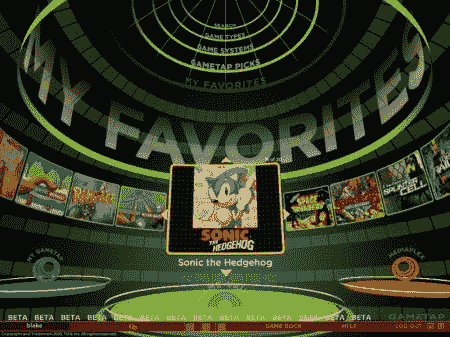

# 苹果电脑上的 GameTap Now:PPC 用户未被邀请

> 原文：<https://web.archive.org/web/http://techcrunch.com/2007/07/10/gametap-now-on-macs-ppc-users-not-invited/>

多亏了 GameTap，作为游戏玩家的 Mac 用户(超过一半的 CG 用户)现在可以沉迷于 500 款视频游戏。让我们澄清一下:基于英特尔的系统上的 Mac 用户可以开始他们的“游戏”你会在服务上找到一系列不错的游戏，比如*街头霸王阿尔法 3* (我想我现在有 24 个版本的游戏)和*合金弹头*，以防你想玩一个只有那些 SNK 怪人才玩过的游戏。

GameTap 每月收费 9.95 美元，用于访问所有 is 财富。我一回到办公室就试试。

GameTap 向 Mac 用户提供 500 款游戏

[GameTap](https://web.archive.org/web/20160407140246/http://www.gametap.com/home/)