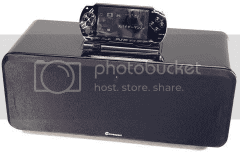

# 游戏专家第 4 阶段 PSP 高保真 TechCrunch

> 原文：<https://web.archive.org/web/http://techcrunch.com:80/2006/09/21/gamexpert-phase-4-psp-hi-fi/>

# 游戏专家第 4 阶段 PSP Hi-Fi

这是那种你必须停下来问问自己，“这真的有必要吗？”Gamexpert 4 PSP Hi-Fi 除了非常显眼和笨重之外，还通过两个中音驱动器和一个朝下的低音炮增加了 23 瓦的立体声。dock 有一个辅助输入，这样你就可以连接其他东西而不是你的 PSP。它还包括一个遥控器。

有人能看到实际使用这个东西吗？看起来玩一个粘在这个东西上的 PSP 会非常尴尬。也许如果它是无线的什么的。售价 200 英镑，约合 376 美元。

[Gamexpert 发布 PSP Hi-Fi](https://web.archive.org/web/20220612105434/http://www.techdigest.tv/2006/09/gamexpert_launc.html)【tech digest via[Gizmodo](https://web.archive.org/web/20220612105434/http://www.gizmodo.com/gadgets/portable-media/gamexpert-phase-4-psp-hifi-costly-raftershaking-for-psp-202206.php)