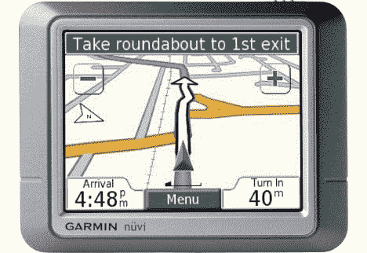

# Garmin 宣布预算文本到语音的 PND，nüvi 260 | TechCrunch

> 原文：<https://web.archive.org/web/http://techcrunch.com/2007/08/07/garmin-announces-budget-text-to-speech-pnd-nuvi-260/>

Garmin 最新进入 nüvi 系列的个人导航设备成本较低，但功能相当全面。nüvi 260 可以昂首阔步地走来走去，因为它具有文本到语音的功能，这是一件大事，因为司机应该把眼睛放在路上，而不是眯着眼睛看着 GPS 屏幕，试图找出应该转向哪里。你们中的一些人可能会对这一功能嗤之以鼻，因为它应该是任何 PND 的标准，但 nüvi 260 大约是一副纸牌大小，配有 3.5 英寸触摸屏和 SD 扩展槽，仅售 499.99 美元。那是一个很小的 PND，屏幕很大，所以不要太势利。

[新闻稿](https://web.archive.org/web/20150531072711/http://www8.garmin.com/pressroom/mobile/080607.html)