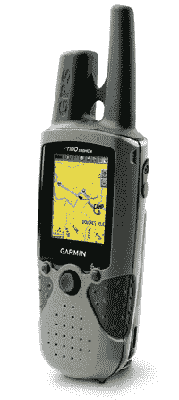

# Garmin 的 530HCx 和 520HCx 双向无线电 TechCrunch

> 原文：<https://web.archive.org/web/http://techcrunch.com/2007/05/11/garmins-530hcx-and-520hcx-two-way-radios/>

# Garmin 的 530HCx 和 520HCx 双向无线电

Garmin 多年来凭借其对讲机建立了很多良好的信誉，今天又推出了两款，绿诺 520HCx 和 530HCx(即 one)。像过去的 Garmin goodies(哦，看，头韵)，这两个有内置的 GPS 和足够的地图，以防止你和你的部落花 40 年在沙漠中徘徊。与之前的机型相比，这两款机型拥有更快的处理器和一个 microSD 插槽。它们甚至是防水的，如果你的冒险将你带入黑暗的深渊。你可以花 500 美元买到 530HCx，它的兄弟姐妹 520HCx 没有天气接收器、指南针或高度计，价格为 450 美元。六月找他们。如果你敢。

[绿诺科技 530HCx](https://web.archive.org/web/20221006214315/https://buy.garmin.com/shop/shop.do?cID=146&pID=8523)

[绿诺 520HCx](https://web.archive.org/web/20221006214315/https://buy.garmin.com/shop/shop.do?cID=146&pID=8522) 【佳明 via [Gizmodo](https://web.archive.org/web/20221006214315/http://gizmodo.com/gadgets/never-lost-again/garmin-intros-520hcx-and-530hcx-gps-communicators-259709.php)