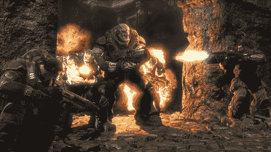

# 战争机器开始行动| TechCrunch

> 原文：<https://web.archive.org/web/http://techcrunch.com:80/2007/07/27/gears-of-war-get-action-figured/>

你们中的许多人可能玩过《特种部队》和《变形金刚》以及当时流行的动作玩偶，所以你会理解我对目前市场上缺乏高质量动作玩偶的沮丧。他们很廉价，缺乏往日的活力，或者他们只是太复杂而不能玩。新变形金刚因此臭名昭著。但是新一波浪潮即将到来，伙计们，系好安全带。

男孩和他们的玩具，对吗？不甘落后于*光环*即将推出的动作人偶系列，Epic 已经宣布了*战争机器*动作人偶、半身像、雕像、立体模型和游戏道具复制品以及任何可能随之而来的续集。整个系列将在明年的某个时候亮相。我等不及了！

[新闻稿](https://web.archive.org/web/20160505004347/http://www.necaonline.com/article/detail/126)